# 🌿 BÁO CÁO FLOW CODE & SƠ ĐỒ HỆ THỐNG TRỌNG TÂM

> **Tài liệu phân tích luồng code (Flow Code), sơ đồ khối, sơ đồ tuần tự và tra cứu dòng lệnh chi tiết cho 5 nhóm chức năng trọng tâm:**
> 1. 🌡️ **NHÓM 1: Cảm biến nhiệt độ & độ ẩm DHT11** *(Khởi tạo $\rightarrow$ Đọc lấy mẫu $\rightarrow$ Đóng gói gửi UART/MQTT $\rightarrow$ Xử lý Backend/Broker $\rightarrow$ Hiển thị Frontend Dashboard/Charts/Cảnh báo $\rightarrow$ Lưu trữ & Realtime Supabase)*
> 2. 📟 **NHÓM 2: Màn hình LCD 16x2 I2C (Phần cứng & Mô phỏng Web)** *(Khởi tạo I2C 0x27 & DOM $\rightarrow$ Luân chuyển 2 trang Môi trường & Thiết bị $\rightarrow$ Cơ chế xuất chế độ Chủ động / Bị động $\rightarrow$ Bộ đệm chuẩn 16 ký tự `pad16` $\rightarrow$ Ma trận 16x2 ký tự)*
> 3. 📧📱 **NHÓM 3: Dịch vụ gửi Email (Supabase) & Thông báo nhanh qua điện thoại (Pushsafer)** *(Cảnh báo quá nhiệt DHT11, Thiết bị & Khôi phục tài khoản)*
> 4. 📊📈 **NHÓM 4: Cơ sở dữ liệu (Supabase) & Biểu đồ Time-series đa đường (Chart.js)** *(Lưu trữ PostgreSQL Cloud, Realtime WebSockets, Biểu đồ trục kép & Xuất CSV)*
> 5. 🔐🔑 **NHÓM 5: Bảo mật hệ thống & Quản lý tài khoản (Supabase Auth & OTP PIN)** *(Đăng nhập, Duy trì phiên đăng nhập, Đăng xuất, Quên mật khẩu qua mã OTP PIN 6 số)*

---

## 📑 BẢNG TRA CỨU NHANH THEO CÁC NHÓM LOGIC (FILE - HÀM - DÒNG CODE)

| Nhóm Chức Năng | Tầng Hệ Thống | Tên File | Tên Hàm / Đoạn Code | Vị Trí Dòng Code | Nhiệm Vụ Chi Tiết |
| :--- | :--- | :--- | :--- | :---: | :--- |
| **1. Cảm biến DHT11** | **Hardware Uno** | `do_an_cay/do_an_cay.ino` | `setup()` | **6 - 7, 31, 87 - 89** | Định nghĩa chân A2, khởi tạo đối tượng `DHT dht(A2, DHT11)`, kích hoạt `dht.begin()` |
| | | `do_an_cay/do_an_cay.ino` | `readSensors()` | **171 - 179** | Đọc nhiệt độ `dht.readTemperature()` & độ ẩm `dht.readHumidity()`, lọc nhiễu `!isnan()` |
| | | `do_an_cay/do_an_cay.ino` | `sendDataToESP()` | **194 - 212** | Đóng gói JSON `{"temp":28.5,"hum":70,...}` gửi qua UART Serial 9600 |
| | **Gateway ESP8266** | `esp_wifi/esp_wifi.ino` | `loop()` | **42 - 57** | Đọc chuỗi JSON từ Serial buffer, kiểm tra hợp lệ và Publish lên Topic Sensors |
| | **Web Frontend & Charts**| `js/mqttClient.js` | `client.on("message")` | **57 - 128** | Nhận payload MQTT, bóc tách `temp`/`hum`, gán `#metric-temp-val`, `#metric-hum-val` |
| | | `js/app.js` | `processIncomingSensorData()` | **832 - 897** | Điều phối dữ liệu cảm biến, kiểm tra cảnh báo quá nhiệt `temp > 38°C` |
| | | `js/charts.js` | `appendDataPoint()` | **132 - 156** | Đẩy điểm nhiệt độ vào trục trái (`yTemp`) và độ ẩm vào trục phải (`yPercent`) |
| | **Supabase DB** | `supabase/schema.sql` | Table `sensor_logs` | **6 - 15, 49, 54** | Bảng PostgreSQL lưu trữ `temperature`, `humidity`, kích hoạt RLS & Realtime |
| | | `js/supabaseClient.js` | `pushSensorData()` | **327 - 344** | Ghi bản ghi cảm biến mới vào bảng `sensor_logs` trên Supabase Cloud |
| | | `js/charts.js` | `exportToCSV()` | **197 - 223** | Trích xuất toàn bộ dữ liệu đo đạc DHT11 ra file CSV UTF-8 (BOM) cho Excel |
| **2. Màn hình LCD 16x2**| **Hardware Uno** | `do_an_cay/do_an_cay.ino` | `setup()` | **90 - 102** | Khởi tạo `lcd.init()`, `lcd.backlight()`, nạp ký tự độ `°C` và hiển thị Splash Screen |
| | | `do_an_cay/do_an_cay.ino` | `updateLCD()` | **259 - 290** | Luân chuyển 2 trang: Trang 1 (`T:..C H:..%`), Trang 2 (`Che do: TU DONG/THU CONG`) |
| | | `do_an_cay/do_an_cay.ino` | `parseCommand()` | **230 - 256** | Giải mã lệnh `MODE:AUTO` / `MODE:MANUAL` từ Web để đổi biến `isAutoMode` |
| | **Gateway ESP8266** | `esp_wifi/esp_wifi.ino` | `mqttCallback()` | **73 - 85** | Nhận lệnh `MODE:AUTO/MANUAL` từ Topic Control bắn xuống Uno qua Serial |
| | **Web Dashboard** | `js/app.js` | `setSystemMode()` | **672 - 697** | Xử lý thao tác bấm nút chế độ của user, gửi lệnh MQTT `MODE:AUTO/MANUAL` |
| | **Mô phỏng LCD** | `js/lcdSimulator.js` | `updateFromSensors()` | **48 - 68** | Định dạng chuỗi `Temp:xx.xC H:xx%` (Dòng 1) và `Soil:xx% [AUTO/MANUAL]` (Dòng 2) |
| | | `js/lcdSimulator.js` | `pad16()`, `updateDisplay()` | **15 - 42** | Cắt/đệm chuẩn 16 ký tự và ghi vào DOM HTML `#lcd-line-1`, `#lcd-line-2` |
| **3. Email & Pushsafer**| **Pushsafer (Phone)** | `js/notificationService.js`| `sendPushsaferNotification()`| **16 - 68** | Gửi HTTP POST tới Pushsafer API đẩy thông báo khẩn khi DHT11 quá nhiệt (>38°C) |
| | **Email & Supabase** | `js/notificationService.js`| `sendEmailNotification()` | **76 - 124** | Gửi Email HTML qua FormSubmit API và gọi `pushAlertLog()` lưu bảng `alert_logs` |
| | | `js/app.js` | `sendResetPinCode()` | **239 - 300** | Sinh mã PIN 6 số, lưu Supabase (`save_reset_pin`) và gửi Email khôi phục |
| **4. Database & Charts**| **Supabase DB** | `js/supabaseClient.js` | `subscribeRealtime()` | **191 - 233** | Lắng nghe WebSocket sự kiện `INSERT` trên bảng `sensor_logs` |
| | | `js/supabaseClient.js` | `fetchSensorHistory()` | **240 - 262** | Truy vấn lịch sử chuỗi thời gian vẽ biểu đồ ban đầu (Cold Start) |
| | **Engine Biểu Đồ** | `js/charts.js` | `initChart()` | **13 - 127** | Khởi tạo Chart.js đa đường với 2 trục Y (`yTemp` °C và `yPercent` %) |
| **5. Auth & Quên Mật Khẩu**| **Supabase Auth** | `js/supabaseClient.js` | `signInWithPassword()` | **58 - 95** | Xác thực tài khoản đăng nhập bảo mật qua Supabase Auth API / Bcrypt RPC |
| | | `js/supabaseClient.js` | `resetPasswordWithPin()` | **152 - 168** | Gọi Supabase RPC function xác thực PIN & đổi mật khẩu mới |
| | **App Core Auth** | `js/app.js` | `checkAuthSession()` | **107 - 125** | Tự động kiểm tra phiên đăng nhập đã lưu trong LocalStorage / Supabase Session |
| | | `js/app.js` | `handleLogin()`, `handleLogout()` | **162 - 208** | Tiếp nhận Email/Password, gọi Supabase Auth và chuyển đổi View |

---

# 🌡️ NHÓM 1: CẢM BIẾN NHIỆT ĐỘ & ĐỘ ẨM DHT11

### 1.1. Sơ Đồ Khối Toàn Diện 6 Giai Đoạn Luồng DHT11 (End-to-End Flowchart)

Luồng dữ liệu của cảm biến **DHT11** được thiết kế khép kín và phân tầng rõ ràng qua **6 giai đoạn** từ phần cứng đo đạc, truyền thông mạng, phân phối đám mây đến giao diện trực quan và lưu trữ cơ sở dữ liệu:

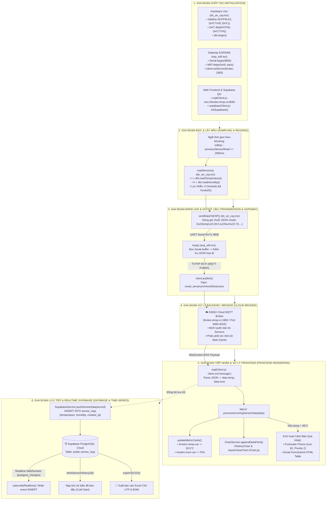

---

### 1.2. Sơ Đồ Tuần Tự Toàn Diện Luồng DHT11 (Full Sequence Diagram)

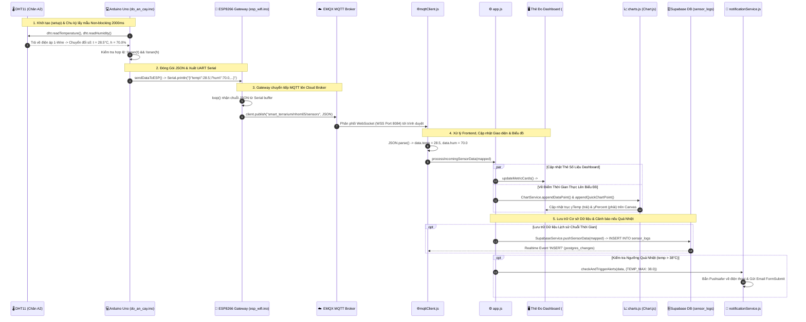

---

### 1.3. Phân Tích Chuyên Sâu 6 Giai Đoạn Cốt Lõi Của Luồng DHT11

#### Giai Đoạn 1: Khởi Tạo Hệ Thống (Initialization)
1. **Phần cứng Arduino Uno ([do_an_cay.ino](file:///d:/web_vlcntt/do_an_cay/do_an_cay.ino)):**
   * Định nghĩa chân dữ liệu `DHTPIN A2` và kiểu cảm biến `DHTTYPE DHT11` (Dòng 6 – 7).
   * Khởi tạo đối tượng toàn cục `DHT dht(DHTPIN, DHTTYPE)` (Dòng 31).
   * Trong hàm `setup()` (Dòng 87 – 89): Gọi `dht.begin()` để kích hoạt giao tiếp 1-Wire.
2. **Gateway ESP8266 ([esp_wifi.ino](file:///d:/web_vlcntt/esp_wifi/esp_wifi.ino)):**
   * Cấu hình Serial baudrate `9600` kết nối trực tiếp với Arduino Uno (Dòng 25).
   * Kết nối mạng Wi-Fi qua `setupWiFi()` ở chế độ `WIFI_STA` (Dòng 60 – 70).
   * Cấu hình MQTT Broker `broker.emqx.io` cổng `1883` qua `client.setServer()` (Dòng 31 – 32).
3. **Web Frontend & Supabase ([js/mqttClient.js](file:///d:/web_vlcntt/js/mqttClient.js) & [js/supabaseClient.js](file:///d:/web_vlcntt/js/supabaseClient.js)):**
   * Kết nối WebSocket bảo mật tới `wss://broker.emqx.io:8084/mqtt` và subscribe topic `smart_terrarium/nhom05/sensors` (Dòng 20 – 45 trong `mqttClient.js`).
   * Khởi tạo Supabase SDK qua `createClient(SUPABASE_URL, SUPABASE_ANON_KEY)` (Dòng 15 – 51 trong `supabaseClient.js`).

---

#### Giai Đoạn 2: Đọc Cảm Biến & Kiểm Tra Tính Hợp Lệ (Sampling & Validation)
* **Kỹ thuật lấy mẫu Non-blocking:** Sử dụng bộ đếm thời gian `millis() - previousSensorRead >= sensorInterval` (`2000ms`) trong `loop()` (Dòng 111 – 116 của `do_an_cay.ino`) giúp hệ thống vừa đọc định kỳ 2 giây/lần vừa không bị block luồng xử lý Serial và Relay.
* **Hàm đọc cảm biến `readSensors()` (Dòng 171 – 179):**
  ```cpp
  // Dòng 171-179 trong do_an_cay/do_an_cay.ino
  void readSensors() {
    // 1. Đọc DHT11
    float t = dht.readTemperature(); // Đọc nhiệt độ (°C)
    float h = dht.readHumidity();    // Đọc độ ẩm không khí (%RH)
    if (!isnan(t) && !isnan(h)) {    // Bộ lọc khử nhiễu NaN (Not a Number)
      temperature = t;
      humidity = h;
    }
    ...
  }
  ```

---

#### Giai Đoạn 3: Đóng Gói Chuỗi JSON & Gửi Qua Gateway ESP8266 (Transmission)
* **Đóng gói JSON trên Arduino Uno (`sendDataToESP()`, Dòng 194 – 212):**
  Chuỗi JSON chuẩn chứa đầy đủ các trường dữ liệu cảm biến và trạng thái chấp hành được xuất qua cổng UART Serial:
  ```cpp
  // Dòng 197-211 trong do_an_cay/do_an_cay.ino
  Serial.print(F("{\"temp\":"));
  Serial.print(temperature, 1);
  Serial.print(F(",\"hum\":"));
  Serial.print(humidity, 1);
  Serial.print(F(",\"soil\":"));
  Serial.print(soilPercent);
  Serial.print(F(",\"ldr\":"));
  Serial.print(ldrPercent);
  Serial.print(F(",\"pump\":"));
  Serial.print(pumpState ? 1 : 0);
  Serial.print(F(",\"led\":"));
  Serial.print(ledState ? 1 : 0);
  Serial.print(F(",\"auto\":"));
  Serial.print(isAutoMode ? 1 : 0);
  Serial.println(F("}"));
  ```
* **Chuyển tiếp qua ESP8266 Gateway (`loop()`, Dòng 42 – 57 trong `esp_wifi.ino`):**
  ESP8266 liên tục gom từng byte Serial vào `serialData`. Khi gặp ký tự xuống dòng `\n` hoặc `\r`, nó kiểm tra chuỗi có hợp lệ `startsWith("{") && endsWith("}")` và thực hiện Publish lên Topic MQTT:
  ```cpp
  // Dòng 48-52 trong esp_wifi/esp_wifi.ino
  if (serialData.startsWith("{") && serialData.endsWith("}")) {
    client.publish(topic_sensors, serialData.c_str());
  }
  ```

---

#### Giai Đoạn 4: Xử Lý Backend & Cloud Broker
* **MQTT Broker (`broker.emqx.io:1883` / WSS `8084`):**
  Đóng vai trò là trung tâm phân phối dữ liệu (Message Broker), chuyển tiếp gói tin từ ESP8266 tới toàn bộ các Client đã kết nối qua giao thức WebSocket WSS bảo mật.
* **Topic phân luồng:** `smart_terrarium/nhom05/sensors`.

---

#### Giai Đoạn 5: Tiếp Nhận, Xử Lý Frontend & Cập Nhật Giao Diện (Frontend Rendering)
* **Bóc tách dữ liệu tại `mqttClient.js` (Dòng 57 – 128):**
  ```javascript
  // Dòng 76-85 trong js/mqttClient.js
  const data = JSON.parse(payloadStr);
  const mapped = {
      temperature: data.temp !== undefined ? parseFloat(data.temp) : 0.0,
      humidity: data.hum !== undefined ? parseFloat(data.hum) : 0.0,
      soil_moisture: data.soil !== undefined ? parseFloat(data.soil) : 0.0,
      light_level: data.ldr !== undefined ? (parseFloat(data.ldr) * 10) : 0.0,
      is_dark: data.ldr !== undefined ? (parseFloat(data.ldr) < 30) : false,
      created_at: new Date().toISOString()
  };
  ```
* **Cập nhật các khối giao diện tương ứng:**
  1. **Thẻ đo Dashboard (`updateMetricCards()`, Dòng 899 – 915 trong `app.js`):**
     * Gán `mapped.temperature.toFixed(1) + "°C"` vào `#metric-temp-val` ([index.html: Dòng 438](file:///d:/web_vlcntt/index.html#L438)).
     * Gán `mapped.humidity.toFixed(0) + "%"` vào `#metric-hum-val` ([index.html: Dòng 455](file:///d:/web_vlcntt/index.html#L455)).
  2. **Vẽ biểu đồ thời gian thực (`ChartService.appendDataPoint()`, Dòng 132 – 156 trong `charts.js`):**
     * Đẩy `mapped.temperature` vào Dataset 0 (trục trái `yTemp` màu Hổ phách `#f59e0b`).
     * Đẩy `mapped.humidity` vào Dataset 1 (trục phải `yPercent` màu Cyan `#06b6d4`).
     * Gọi `mainChart.update('none')` để render 60 FPS mượt mà không giật lag.
  3. **Kích hoạt cảnh báo quá nhiệt (`processIncomingSensorData()`, Dòng 884 – 897 trong `app.js`):**
     * Nếu `data.temperature > AppState.tempMaxThreshold` (ngưỡng mặc định `38.0°C`), hệ thống tự động ghi nhật ký cảnh báo và gọi `NotificationService.checkAndTriggerAlerts()` để bắn thông báo khẩn qua Pushsafer và Email.

---

#### Giai Đoạn 6: Lưu Trữ Vào Cơ Sở Dữ Liệu Supabase & Đồng Bộ Realtime (Database & Time-series)
* **Cấu trúc bảng PostgreSQL `sensor_logs` ([supabase/schema.sql](file:///d:/web_vlcntt/supabase/schema.sql)):**
  ```sql
  -- Dòng 6-14 trong supabase/schema.sql
  CREATE TABLE IF NOT EXISTS public.sensor_logs (
      id BIGINT GENERATED BY DEFAULT AS IDENTITY PRIMARY KEY,
      created_at TIMESTAMPTZ DEFAULT TIMEZONE('Asia/Ho_Chi_Minh', NOW()) NOT NULL,
      temperature NUMERIC(5, 2) NOT NULL,    -- Nhiệt độ (°C) từ DHT11
      humidity NUMERIC(5, 2) NOT NULL,       -- Độ ẩm không khí (%) từ DHT11
      soil_moisture NUMERIC(5, 2) NOT NULL,  -- Độ ẩm đất (%) từ SMS-V1
      light_level NUMERIC(7, 2) DEFAULT 0,   -- Ánh sáng (Lux) từ LDR
      is_dark BOOLEAN DEFAULT FALSE          -- Trạng thái Trời tối / Sáng
  );
  ```
* **Hàm ghi dữ liệu cảm biến (`pushSensorData()`, Dòng 327 – 344 trong `js/supabaseClient.js`):**
  ```javascript
  // Dòng 327-344 trong js/supabaseClient.js
  async function pushSensorData(record) {
      if (!supabaseClient) initSupabase();
      if (!supabaseClient) return false;
      try {
          const { error } = await supabaseClient
              .from('sensor_logs')
              .insert([record]);
          return !error;
      } catch (err) {
          return false;
      }
  }
  ```
* **Lắng nghe WebSockets Realtime (`subscribeRealtime()`, Dòng 191 – 233 trong `js/supabaseClient.js`):**
  Kích hoạt kênh lắng nghe sự kiện `INSERT` trên bảng `sensor_logs` để đồng bộ thời gian thực cho mọi thiết bị truy cập hệ thống.
* **Trích xuất dữ liệu ra file báo cáo Excel (`exportToCSV()`, Dòng 197 – 223 trong `js/charts.js`):**
  Xuất dữ liệu lịch sử đo đạc DHT11 ra file `biosync_sensor_logs_YYYY-MM-DD.csv` định dạng chuẩn UTF-8 kèm mã BOM `\uFEFF` giúp mở trực tiếp trên Microsoft Excel không bị lỗi font tiếng Việt.

---

### 1.4. Bảng Ma Trận Đối Soát Dữ Liệu DHT11 Xuyên Suốt 6 Tầng Hệ Thống

| Tầng Hệ Thống | Thành Phần Đảm Nhiệm | Định Dạng Dữ Liệu | Tên Biến / Trường Dữ Liệu | Ví Dụ Giá Trị Cụ Thể |
| :--- | :--- | :--- | :--- | :--- |
| **1. Cảm biến DHT11** | Chân tín hiệu Data (A2) | Xung điện áp 1-Wire | Tín hiệu xung 40-bit | 16-bit độ ẩm + 16-bit nhiệt độ + 8-bit checksum |
| **2. Arduino Uno** | Thư viện `DHT.h` | `float` (IEEE 754) | `temperature`, `humidity` | `temperature = 28.5`, `humidity = 70.0` |
| **3. Truyền UART & MQTT** | Serial Uno $\rightarrow$ ESP8266 | Chuỗi JSON chuẩn | `{"temp": float, "hum": float}`| `{"temp":28.5,"hum":70.0,"soil":65,...}` |
| **4. Cloud MQTT Broker** | EMQX Cloud (1883/8084) | JSON over WebSocket | `smart_terrarium/nhom05/sensors` | Gói tin JSON thời gian thực |
| **5. Frontend Web** | `mqttClient.js` & `app.js` | Object JS & DOM Text | `mapped.temperature`, `mapped.humidity` | `#metric-temp-val`: `28.5°C`, `#metric-hum-val`: `70%` |
| **6. Supabase Database** | PostgreSQL Cloud | Table `sensor_logs` | `temperature`, `humidity` | `temperature: 28.50`, `humidity: 70.00` |
| **7. Báo Cáo CSV** | `charts.js` | File CSV UTF-8 BOM | `NhietDo_C`, `DoAmKhongKhi_%` | `"2026-08-19 13:00:00",28.5,70,65,800,KHONG` |

---

### 1.5. Vị Trí Cụ Thể Trên Giao Diện Frontend ([index.html](file:///d:/web_vlcntt/index.html))

| Tên Khối Giao Diện | File Nguồn | ID Phần Tử DOM | Vị Trí Dòng Code | Chức Năng Hiển Thị |
| :--- | :--- | :--- | :---: | :--- |
| **Thẻ Đo Nhiệt Độ Dashboard**| `index.html`| `#metric-temp-val` | **Dòng 438** | Thẻ lớn hiển thị số đo nhiệt độ tức thời (°C) từ DHT11 |
| **Thẻ Đo Độ Ẩm Dashboard** | `index.html` | `#metric-hum-val` | **Dòng 455** | Thẻ lớn hiển thị số đo độ ẩm không khí (%) từ DHT11 |
| **Canvas Biểu Đồ Dashboard**| `index.html` | `#quickViewChart`| **Dòng 395** | Vùng vẽ biểu đồ nhanh tại trang Tổng quan |
| **Canvas Biểu Đồ Analytics**| `index.html` | `#historyChart` | **Dòng 578** | Vùng vẽ biểu đồ phân tích đa đường toàn diện |

---

# 📟 NHÓM 2: MÀN HÌNH LCD 16X2 I2C (PHẦN CỨNG & MÔ PHỎNG WEB)

### 2.1. Sơ Đồ Khối Toàn Diện Luồng LCD 16x2 (Hardware & Web Simulator)

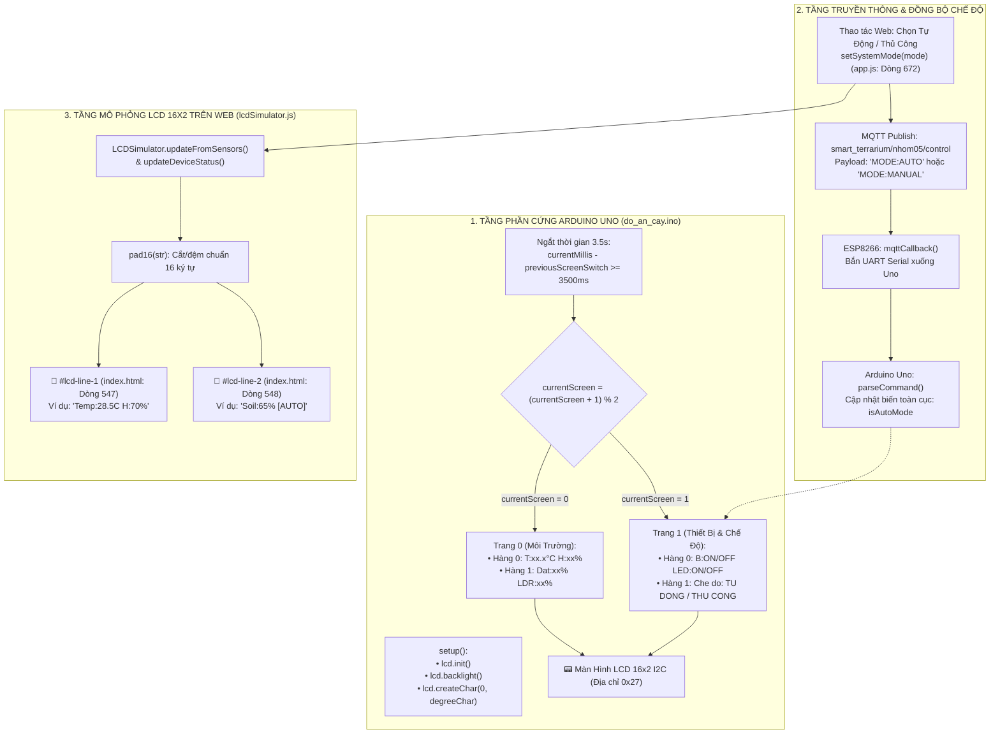

---

### 2.2. Sơ Đồ Tuần Tự Luân Chuyển Trang & Cập Nhật LCD (Sequence Diagram)

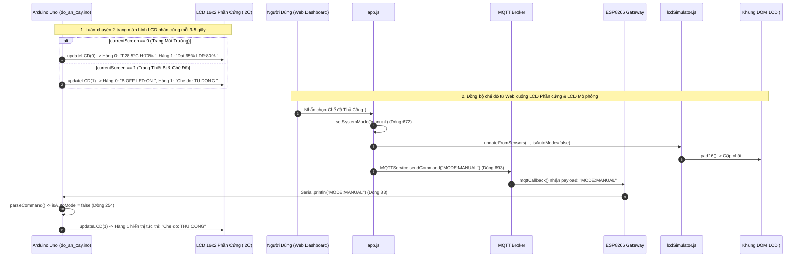

---

### 2.3. Bảng Ma Trận 16x2 Ký Tự (Hardware LCD & Web Simulator)

#### A. Màn hình LCD 16x2 Phần Cứng (Luân chuyển mỗi 3.5 giây qua `updateLCD()`)
```text
Trang 0 (Môi Trường):
[Hàng 0] | T | : | 2 | 8 | . | 5 | ° | C |   | H | : | 7 | 0 | % |   |   | (16 ký tự)
[Hàng 1] | D | a | t | : | 6 | 5 | % |   |   | L | D | R | : | 8 | 0 | % | (16 ký tự)

Trang 1 (Thiết Bị & Chế Độ):
[Hàng 0] | B | : | O | F | F |   |   | L | E | D | : | O | N |   |   |   | (16 ký tự)
[Hàng 1] | C | h | e |   | d | o | : |   | T | U |   | D | O | N | G |   | (16 ký tự)
```

#### B. Màn hình LCD 16x2 Mô Phỏng Web (`lcdSimulator.js` $\rightarrow$ `#tab-analytics`)
```text
Trang Cảm Biến:
[Dòng 1 - #lcd-line-1] | T | e | m | p | : | 2 | 8 | . | 5 | C |   | H | : | 7 | 0 | % | (16 ký tự)
[Dòng 2 - #lcd-line-2] | S | o | i | l | : | 6 | 5 | % |   | [ | A | U | T | O | ] |   | (16 ký tự)

Trang Thiết Bị & Chế Độ (updateDeviceStatus):
[Dòng 1 - #lcd-line-1] | B | : | O | F | F |   |   | L | E | D | : | O | N |   |   |   | (16 ký tự)
[Dòng 2 - #lcd-line-2] | C | h | e |   | d | o | : |   | T | H | U |   | C | O | N | G | (16 ký tự)
```

---

### 2.4. Luồng Xuất Chế Độ Vận Hành Chủ Động (Auto) / Bị Động (Manual) Lên LCD 16x2

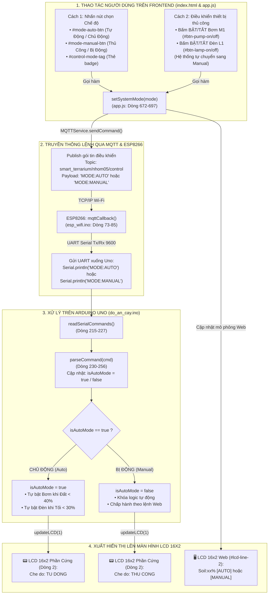

---

### 2.5. Bảng Đối Soát Hành Động Người Dùng $\rightarrow$ Dữ Liệu LCD 16x2

| Thao Tác Của Người Dùng | Hàm JS Kích Hoạt | Lệnh Gửi MQTT / Serial | Trạng Thái `isAutoMode` | Hiển Thị LCD Phần Cứng (Trang 1 Dòng 1) | Hiển Thị LCD Mô Phỏng Web (Dòng 2) |
| :--- | :--- | :--- | :---: | :--- | :--- |
| **Bấm nút [Tự Động]** | `setSystemMode('auto')` | `"MODE:AUTO"` | `true` (Chủ động) | `Che do: TU DONG ` | `Soil:xx% [AUTO]  ` |
| **Bấm nút [Thủ Công]** | `setSystemMode('manual')`| `"MODE:MANUAL"` | `false` (Bị động) | `Che do: THU CONG` | `Soil:xx% [MANUAL]` |
| **Bấm BẬT Máy Bơm M1** | `turnOnPump()` | `"PUMP:1"` | `false` (Bị động) | `B:ON   Che do: THU CONG` | `Soil:xx% [MANUAL]` |
| **Bấm TẮT Máy Bơm M1** | `turnOffPump()` | `"PUMP:0"` | `false` (Bị động) | `B:OFF  Che do: THU CONG` | `Soil:xx% [MANUAL]` |
| **Bấm BẬT Đèn LED L1** | `turnOnLamp()` | `"LED:1"` | `false` (Bị động) | `LED:ON Che do: THU CONG` | `Soil:xx% [MANUAL]` |
| **Bấm TẮT Đèn LED L1** | `turnOffLamp()` | `"LED:0"` | `false` (Bị động) | `LED:OFF Che do: THU CONG`| `Soil:xx% [MANUAL]` |

---

### 2.6. Vị Trí Cụ Thể Trên Giao Diện Frontend ([index.html](file:///d:/web_vlcntt/index.html))

| Tên Khối Giao Diện | File Nguồn | ID Phần Tử DOM | Vị Trí Dòng Code | Chức Năng Hiển Thị |
| :--- | :--- | :--- | :---: | :--- |
| **Khung Màn hình LCD 16x2** | `index.html` | `#lcd-screen-container` | **Dòng 546** | Hộp chứa nền xanh LCD retro, viền phát sáng, chứa 2 dòng hiển thị |
| **Dòng 1 LCD 16x2** | `index.html` | `#lcd-line-1` | **Dòng 547** | Hiển thị chuỗi Nhiệt độ & Độ ẩm DHT11 (`Temp:xx.xC H:xx%`) |
| **Dòng 2 LCD 16x2** | `index.html` | `#lcd-line-2` | **Dòng 548** | Hiển thị chuỗi Độ ẩm đất & Trạng thái sáng (`Soil:xx% Lgt:DARK/SUNNY`) |
| **Tab Chứa LCD Simulator** | `index.html` | `#tab-analytics` | **Dòng 524** | Tab Phân tích & Dự đoán (Analytics) trên thanh điều hướng |

---

### 2.7. Chi Tiết Các Hàm & Dòng Lệnh Cốt Lõi (Nhóm 2)

#### 1. Mạch Phần Cứng Arduino Uno ([do_an_cay.ino](file:///d:/web_vlcntt/do_an_cay/do_an_cay.ino))
* **Khởi tạo chân & LCD I2C (`setup()`, Dòng 87 – 102):**
  ```cpp
  // Dòng 87-102 trong do_an_cay/do_an_cay.ino
  dht.begin();
  lcd.init();
  lcd.backlight();
  lcd.createChar(0, degreeChar); // Nạp byte ký tự °C vào CGRAM của LCD

  lcd.setCursor(0, 0);
  lcd.print("SMART TERRARIUM ");
  lcd.setCursor(0, 1);
  lcd.print("NHOM 05 - 24C03 ");
  delay(2000);
  lcd.clear();
  ```

* **Hiển thị luân phiên 2 trang lên LCD 16x2 I2C (`updateLCD()`, Dòng 259 – 290):**
  ```cpp
  // Dòng 259-290 trong do_an_cay/do_an_cay.ino
  void updateLCD(int screen) {
    if (screen == 0) {
      // Trang 1: Thông số nhiệt độ, độ ẩm không khí & đất, ánh sáng
      lcd.setCursor(0, 0);
      lcd.print("T:");
      lcd.print(temperature, 1);
      lcd.write(0); // Ký tự độ °
      lcd.print("C H:");
      lcd.print(humidity, 0);
      lcd.print("%   ");

      lcd.setCursor(0, 1);
      lcd.print("Dat:");
      lcd.print(soilPercent);
      lcd.print("%  LDR:");
      lcd.print(ldrPercent);
      lcd.print("%   ");
    } 
    else if (screen == 1) {
      // Trang 2: Trạng thái Máy Bơm, Đèn LED & Chế độ vận hành
      lcd.setCursor(0, 0);
      lcd.print("B:");
      lcd.print(pumpState ? "ON " : "OFF");
      lcd.print(" LED:");
      lcd.print(ledState ? "ON " : "OFF");
      lcd.print("    ");

      lcd.setCursor(0, 1);
      lcd.print("Che do: ");
      lcd.print(isAutoMode ? "TU DONG " : "THU CONG");
    }
  }
  ```

#### 2. Mô phỏng LCD 16x2 trên Web ([js/lcdSimulator.js](file:///d:/web_vlcntt/js/lcdSimulator.js))
* **Khởi tạo DOM elements (`initLCD()`, Dòng 24 – 31):**
  ```javascript
  // Dòng 24-31 trong js/lcdSimulator.js
  function initLCD() {
      line1Element = document.getElementById("lcd-line-1");
      line2Element = document.getElementById("lcd-line-2");
      backlightElement = document.getElementById("lcd-screen-container");

      updateDisplay("LCD 16x2 I2C READY", "DHT11 CONNECTED");
  }
  ```

* **Định dạng số liệu dòng 1 & 2 (`updateFromSensors()`, Dòng 48 – 62):**
  ```javascript
  // Dòng 48-62 trong js/lcdSimulator.js
  function updateFromSensors(temp, hum, soil, lightIsDark) {
      const tStr = temp !== undefined ? temp.toFixed(1) : "--.-";
      const hStr = hum !== undefined ? hum.toFixed(0) : "--";
      const l1 = `Temp:${tStr}C H:${hStr}%`;

      const sStr = soil !== undefined ? soil.toFixed(0) : "--";
      const lightStr = lightIsDark ? "DARK" : "SUNNY";
      const l2 = `Soil:${sStr}% Lgt:${lightStr}`;

      updateDisplay(l1, l2);
  }
  ```

* **Cắt đệm chuẩn 16 ký tự & Cập nhật DOM HTML (`pad16()` & `updateDisplay()`, Dòng 15 – 42):**
  ```javascript
  // Dòng 15-19 & 35-42 trong js/lcdSimulator.js
  function pad16(str) {
      if (!str) str = "";
      if (str.length > 16) return str.substring(0, 16);
      return str.padEnd(16, " ");
  }

  function updateDisplay(line1Text, line2Text) {
      if (line1Element) line1Element.textContent = pad16(line1Text);
      if (line2Element) line2Element.textContent = pad16(line2Text);
  }
  ```

---

# 📧📱 NHÓM 3: DỊCH VỤ EMAIL (SUPABASE) & THÔNG BÁO NHANH QUA ĐIỆN THOẠI (PUSHSAFER)

### 3.1. Sơ Đồ Khối Toàn Diện (End-to-End Flowchart)

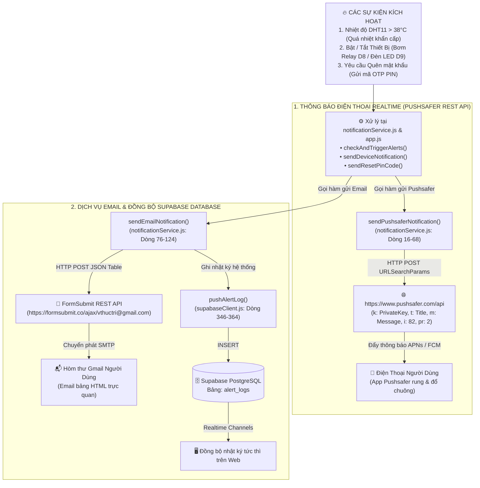

---

### 3.2. Sơ Đồ Tuần Tự Cảnh Báo Quá Nhiệt (Sequence Diagram)

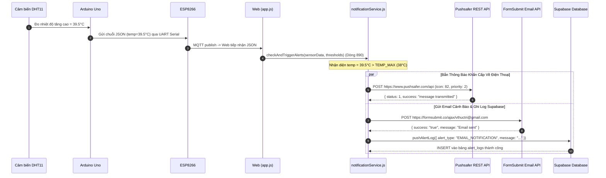

---

### 3.3. Chi Tiết Các Hàm & Dòng Lệnh Cốt Lõi (Nhóm 3)

#### 1. Thông Báo Nhanh Qua Điện Thoại (Pushsafer API)
* **Gửi HTTP POST Pushsafer (`sendPushsaferNotification()`, Dòng 16 – 68 trong `js/notificationService.js`):**
  ```javascript
  // Dòng 36-52 trong js/notificationService.js
  const params = new URLSearchParams({
      k: privateKey.trim(),
      t: title || "Smart Terrarium Alert",
      m: message || "Thông báo từ hệ thống Terrarium",
      s: options.sound !== undefined ? options.sound : "1",      // Chuông
      v: options.vibrate !== undefined ? options.vibrate : "3",  // Rung mạnh
      i: options.icon !== undefined ? options.icon : "82",       // Icon cảm biến
      pr: options.priority !== undefined ? options.priority : "2" // Độ ưu tiên cao nhất
  });

  const response = await fetch("https://www.pushsafer.com/api", {
      method: "POST",
      headers: { "Content-Type": "application/x-www-form-urlencoded" },
      body: params.toString()
  });
  ```

* **Tự động kích hoạt khi DHT11 quá nhiệt (`checkAndTriggerAlerts()`, Dòng 158 – 178 trong `js/notificationService.js`):**
  ```javascript
  // Dòng 163-169 trong js/notificationService.js
  if (temp > thresholds.TEMP_MAX) {
      const title = "🔥 CẢNH BÁO: QUÁ NHIỆT TERRARIUM!";
      const msg = `Nhiệt độ hiện tại đạt ${temp.toFixed(1)}°C (vượt ngưỡng cho phép ${thresholds.TEMP_MAX}°C)...`;
      
      await sendPushsaferNotification(title, msg, { icon: 82, priority: 2 });
      await sendEmailNotification(title, msg);
  }
  ```

* **Thông báo Bật/Tắt thiết bị Bơm & Đèn (`sendDeviceNotification()`, Dòng 132 – 153 trong `js/notificationService.js`):**
  Bắn Pushsafer thông báo khi máy bơm hoặc đèn bật/tắt (manual hoặc auto).

---

#### 2. Dịch Vụ Gửi Email & Đồng Bộ Supabase Database
* **Gửi Email bảng HTML (`sendEmailNotification()`, Dòng 76 – 124 trong `js/notificationService.js`):**
  ```javascript
  // Dòng 90-104 trong js/notificationService.js
  const response = await fetch(`https://formsubmit.co/ajax/${encodeURIComponent(targetEmail)}`, {
      method: "POST",
      headers: { "Content-Type": "application/json", "Accept": "application/json" },
      body: JSON.stringify({
          _subject: `🌱 [Smart Terrarium Nhóm 05] ${subject || 'CẢNH BÁO HỆ THỐNG'}`,
          "Tiêu Đề Cảnh Báo": subject,
          "Nội Dung Chi Tiết": body,
          "Hệ Thống Giám Sát": "BioSync Smart Terrarium - Lớp 24C03 (Nhóm 05)",
          "Thời Gian Ghi Nhận": new Date().toLocaleString("vi-VN"),
          _template: "table"
      })
  });
  ```

* **Ghi nhật ký vào bảng `alert_logs` Supabase (`pushAlertLog()`, Dòng 346 – 364 trong `js/supabaseClient.js`):**
  ```javascript
  // Dòng 351-358 trong js/supabaseClient.js
  const { error } = await supabaseClient
      .from('alert_logs')
      .insert([{
          alert_type: alertObj.alert_type || "EMAIL_NOTIFICATION",
          severity: alertObj.severity || "WARNING",
          message: alertObj.message || ""
      }]);
  ```

* **Email Mã PIN Khôi Phục Tài Khoản (`sendResetPinCode()`, Dòng 239 – 300 trong `js/app.js`):**
  Sinh mã PIN 6 số ngẫu nhiên, lưu vào Supabase và gửi qua Email FormSubmit để xác thực quên mật khẩu.

---

# 📊📈 NHÓM 4: CƠ SỞ DỮ LIỆU (SUPABASE) & BIỂU ĐỒ TIME-SERIES (CHART.JS)ng báo từ hệ thống Terrarium",
      s: options.sound !== undefined ? options.sound : "1",      // Chuông
      v: options.vibrate !== undefined ? options.vibrate : "3",  // Rung mạnh
      i: options.icon !== undefined ? options.icon : "82",       // Icon cảm biến
      pr: options.priority !== undefined ? options.priority : "2" // Độ ưu tiên cao nhất
  });

  const response = await fetch("https://www.pushsafer.com/api", {
      method: "POST",
      headers: { "Content-Type": "application/x-www-form-urlencoded" },
      body: params.toString()
  });
  ```

* **Tự động kích hoạt khi DHT11 quá nhiệt (`checkAndTriggerAlerts()`, Dòng 158 – 178 trong `js/notificationService.js`):**
  ```javascript
  // Dòng 163-169 trong js/notificationService.js
  if (temp > thresholds.TEMP_MAX) {
      const title = "🔥 CẢNH BÁO: QUÁ NHIỆT TERRARIUM!";
      const msg = `Nhiệt độ hiện tại đạt ${temp.toFixed(1)}°C (vượt ngưỡng cho phép ${thresholds.TEMP_MAX}°C)...`;
      
      await sendPushsaferNotification(title, msg, { icon: 82, priority: 2 });
      await sendEmailNotification(title, msg);
  }
  ```

* **Thông báo Bật/Tắt thiết bị Bơm & Đèn (`sendDeviceNotification()`, Dòng 132 – 153 trong `js/notificationService.js`):**
  Bắn Pushsafer thông báo khi máy bơm hoặc đèn bật/tắt (manual hoặc auto).

---

#### 2. Dịch Vụ Gửi Email & Đồng Bộ Supabase Database
* **Gửi Email bảng HTML (`sendEmailNotification()`, Dòng 76 – 124 trong `js/notificationService.js`):**
  ```javascript
  // Dòng 90-104 trong js/notificationService.js
  const response = await fetch(`https://formsubmit.co/ajax/${encodeURIComponent(targetEmail)}`, {
      method: "POST",
      headers: { "Content-Type": "application/json", "Accept": "application/json" },
      body: JSON.stringify({
          _subject: `🌱 [Smart Terrarium Nhóm 05] ${subject || 'CẢNH BÁO HỆ THỐNG'}`,
          "Tiêu Đề Cảnh Báo": subject,
          "Nội Dung Chi Tiết": body,
          "Hệ Thống Giám Sát": "BioSync Smart Terrarium - Lớp 24C03 (Nhóm 05)",
          "Thời Gian Ghi Nhận": new Date().toLocaleString("vi-VN"),
          _template: "table"
      })
  });
  ```

* **Ghi nhật ký vào bảng `alert_logs` Supabase (`pushAlertLog()`, Dòng 346 – 364 trong `js/supabaseClient.js`):**
  ```javascript
  // Dòng 351-358 trong js/supabaseClient.js
  const { error } = await supabaseClient
      .from('alert_logs')
      .insert([{
          alert_type: alertObj.alert_type || "EMAIL_NOTIFICATION",
          severity: alertObj.severity || "WARNING",
          message: alertObj.message || ""
      }]);
  ```

* **Email Mã PIN Khôi Phục Tài Khoản (`sendResetPinCode()`, Dòng 239 – 300 trong `js/app.js`):**
  Sinh mã PIN 6 số ngẫu nhiên, lưu vào Supabase và gửi qua Email FormSubmit để xác thực quên mật khẩu.

---

# 📊📈 NHÓM 3: CƠ SỞ DỮ LIỆU (SUPABASE) & BIỂU ĐỒ TIME-SERIES (CHART.JS)

### 3.1. Sơ Đồ Khối Toàn Diện (End-to-End Flowchart)

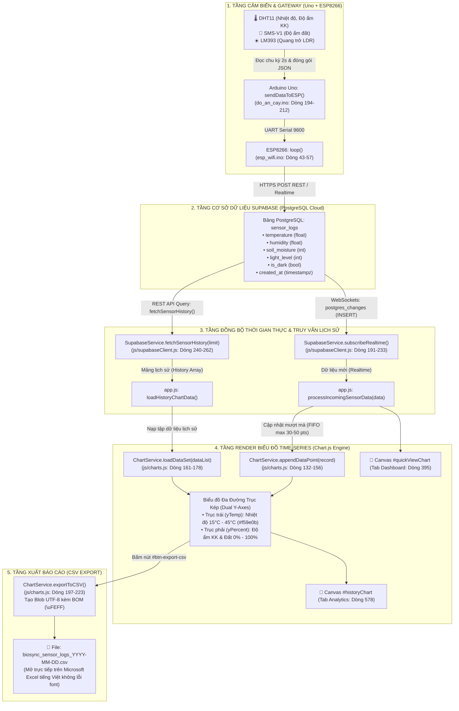

---

### 3.2. Sơ Đồ Tuần Tự Đồng Bộ Dữ Liệu & Render Time-series (Sequence Diagram)

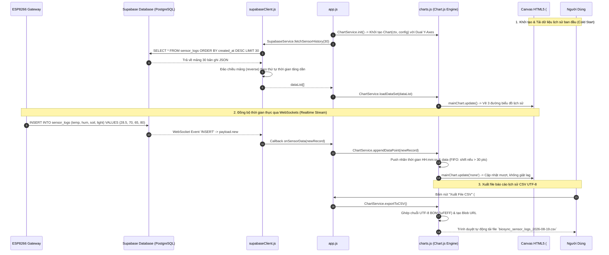

---

### 3.3. Cấu Trúc Bảng Dữ Liệu `sensor_logs` (Supabase PostgreSQL)

| Tên Cột (Column) | Kiểu Dữ Liệu | Ràng Buộc | Ý Nghĩa / Nguồn Cung Cấp |
| :--- | :--- | :--- | :--- |
| `id` | `BIGSERIAL` | `PRIMARY KEY` | Khóa chính tự tăng của mỗi bản ghi đo |
| `created_at` | `TIMESTAMPTZ` | `DEFAULT now()` | Mốc thời gian ISO 8601 (Dùng cho trục hoành Time-series) |
| `temperature` | `NUMERIC(4,1)`| `NOT NULL` | Nhiệt độ môi trường (°C) từ cảm biến DHT11 |
| `humidity` | `NUMERIC(4,1)`| `NOT NULL` | Độ ẩm không khí (%RH) từ cảm biến DHT11 |
| `soil_moisture`| `INTEGER` | `DEFAULT 0` | Độ ẩm đất (%) từ cảm biến điện dung SMS-V1 |
| `light_level` | `INTEGER` | `DEFAULT 0` | Cường độ sáng (%) từ quang trở LDR / LM393 |
| `is_dark` | `BOOLEAN` | `DEFAULT false` | Cờ trạng thái môi trường tối/sáng |

---

### 3.4. Kiến Trúc Hệ Trục Kép Dual Y-Axes & Chiến Lược Cập Nhật Biểu Đồ

1. **Hệ 2 trục tung độc lập (Dual Y-Axes):**
   * **Trục trái (`yTemp`):** Chuyên dụng cho **Nhiệt độ (°C)**, dải đo đề xuất `15°C - 45°C`, nét vẽ màu vàng/hổ phách (`#f59e0b`), vùng phủ gradient `rgba(245, 158, 11, 0.12)`.
   * **Trục phải (`yPercent`):** Chuyên dụng cho **Độ ẩm không khí (%)** (nét vẽ màu Cyan `#06b6d4`) và **Độ ẩm đất (%)** (nét đứt Emerald `#10b981`), dải đo cố định `0% - 100%`.
2. **Cơ chế cập nhật không giật lag (`mainChart.update('none')`):**
   * Tắt animation chuyển cảnh nặng khi nhận điểm realtime mỗi 2 giây, giúp giao diện 60 FPS mượt mà.
   * Áp dụng hàng đợi **FIFO (First In First Out)** giới hạn 30 điểm hiển thị trên màn hình nhằm tránh tràn bộ nhớ RAM trình duyệt.

---

### 3.5. Vị Trí Cụ Thể Trên Giao Diện Frontend ([index.html](file:///d:/web_vlcntt/index.html))

| Tên Phần Tử Giao Diện | File Nguồn | ID Phần Tử DOM | Vị Trí Dòng Code | Chức Năng Chi Tiết |
| :--- | :--- | :--- | :---: | :--- |
| **Canvas Biểu Đồ Time-series Lớn** | `index.html` | `#historyChart` | **Dòng 578** | Vùng vẽ Canvas đồ thị đa đường Chart.js toàn diện |
| **Canvas Biểu Đồ Dashboard Thu Nhỏ**| `index.html` | `#quickViewChart`| **Dòng 395** | Vùng vẽ Canvas biểu đồ nhanh tại trang Tổng quan |
| **Nút Xuất Dữ Liệu CSV** | `index.html` | `#btn-export-csv` | **Dòng 569** | Nút bấm trích xuất toàn bộ dữ liệu time-series ra file CSV |
| **Tab Chứa Biểu Đồ Phân Tích** | `index.html` | `#tab-analytics` | **Dòng 524** | Tab Phân tích dữ liệu & Đồ thị trên thanh điều hướng |
| **Nút Chọn Khung Thời Gian 1H** | `index.html` | `#btn-filter-1h` | **Dòng 562** | Bộ lọc hiển thị dữ liệu lịch sử trong 1 giờ gần nhất |
| **Nút Chọn Khung Thời Gian 24H**| `index.html` | `#btn-filter-24h`| **Dòng 564** | Bộ lọc hiển thị dữ liệu lịch sử trong 24 giờ gần nhất |

---

### 3.6. Chi Tiết Các Hàm & Dòng Lệnh Cốt Lõi (Nhóm 3)

#### 1. Tầng Cơ Sở Dữ Liệu Supabase ([js/supabaseClient.js](file:///d:/web_vlcntt/js/supabaseClient.js))
* **Hàm Ghi Dữ Liệu Cảm Biến Vào Database (`pushSensorData()`, Dòng 327 – 344):**
  ```javascript
  // Dòng 327-344 trong js/supabaseClient.js
  async function pushSensorData(record) {
      if (!supabaseClient) initSupabase();
      if (!supabaseClient) return false;

      try {
          // Thực hiện lệnh INSERT vào bảng PostgreSQL 'sensor_logs'
          const { error } = await supabaseClient
              .from('sensor_logs')
              .insert([record]);

          if (error) {
              console.warn("Lỗi pushSensorData:", error.message);
              return false;
          }
          return true;
      } catch (err) {
          return false;
      }
  }
  ```

* **Hàm Ghi Nhật Ký Cảnh Báo Vào Database (`pushAlertLog()`, Dòng 346 – 364):**
  ```javascript
  // Dòng 346-364 trong js/supabaseClient.js
  async function pushAlertLog(alertObj) {
      if (!supabaseClient) initSupabase();
      if (!supabaseClient) return false;

      try {
          const { error } = await supabaseClient
              .from('alert_logs')
              .insert([{
                  alert_type: alertObj.alert_type || alertObj.type || "SYSTEM_WARN",
                  severity: alertObj.severity || "INFO",
                  message: alertObj.message || ""
              }]);

          if (error) return false;
          return true;
      } catch (err) {
          return false;
      }
  }
  ```

* **Hàm Cập Nhật / Upsert Trạng Thái Điều Khiển Thiết Bị (`updateDeviceControls()`, Dòng 301 – 325):**
  ```javascript
  // Dòng 301-325 trong js/supabaseClient.js
  async function updateDeviceControls(controlsPayload) {
      if (!supabaseClient) initSupabase();
      if (!supabaseClient) return false;

      try {
          const updateRecord = {
              id: 1,
              ...controlsPayload,
              updated_at: new Date().toISOString()
          };
          const { error } = await supabaseClient
              .from('device_controls')
              .upsert(updateRecord);

          return !error;
      } catch (err) {
          return false;
      }
  }
  ```

* **Lắng nghe WebSockets Realtime (`subscribeRealtime()`, Dòng 191 – 233):**
  ```javascript
  // Dòng 201-209 trong js/supabaseClient.js
  realtimeChannel = supabaseClient
      .channel('public:smart_terrarium_realtime')
      // Lắng nghe bản ghi cảm biến mới chèn từ ESP8266
      .on('postgres_changes', { event: 'INSERT', schema: 'public', table: 'sensor_logs' }, payload => {
          console.log("⚡ [Realtime Supabase] Dữ liệu cảm biến mới từ ESP8266:", payload.new);
          if (callbacks.onSensorData) {
              callbacks.onSensorData(payload.new);
          }
      })
      .subscribe();
  ```

* **Truy vấn lịch sử chuỗi thời gian (`fetchSensorHistory()`, Dòng 240 – 262):**
  ```javascript
  // Dòng 245-257 trong js/supabaseClient.js
  const { data, error } = await supabaseClient
      .from('sensor_logs')
      .select('*')
      .order('created_at', { ascending: false })
      .limit(limit);

  if (error) return null;
  // Đảo lại thứ tự thời gian tăng dần để vẽ biểu đồ từ trái sang phải
  return (data || []).reverse();
  ```

#### 2. Tầng Engine Biểu Đồ Chart.js ([js/charts.js](file:///d:/web_vlcntt/js/charts.js))
* **Khởi tạo đồ thị đa đường với hệ 2 trục Y (`initChart()`, Dòng 13 – 127):**
  ```javascript
  // Dòng 22-64 & 99-119 trong js/charts.js
  mainChart = new Chart(ctx, {
      type: 'line',
      data: {
          labels: [],
          datasets: [
              { label: 'Nhiệt độ (°C)', data: [], borderColor: '#f59e0b', yAxisID: 'yTemp' },
              { label: 'Độ ẩm không khí (%)', data: [], borderColor: '#06b6d4', yAxisID: 'yPercent' },
              { label: 'Độ ẩm đất (%)', data: [], borderColor: '#10b981', borderDash: [4, 4], yAxisID: 'yPercent' }
          ]
      },
      options: {
          responsive: true,
          maintainAspectRatio: false,
          scales: {
              yTemp: { type: 'linear', position: 'left', suggestedMin: 15, suggestedMax: 45 },
              yPercent: { type: 'linear', position: 'right', min: 0, max: 100 }
          }
      }
  });
  ```

* **Thêm điểm thời gian thực mượt mà (`appendDataPoint()`, Dòng 132 – 156):**
  ```javascript
  // Dòng 132-156 trong js/charts.js
  function appendDataPoint(record) {
      if (!mainChart) return;
      const timeLabel = new Date(record.created_at || Date.now()).toLocaleTimeString([], { hour: '2-digit', minute: '2-digit', second: '2-digit' });

      mainChart.data.labels.push(timeLabel);
      mainChart.data.datasets[0].data.push(record.temperature);
      mainChart.data.datasets[1].data.push(record.humidity);
      mainChart.data.datasets[2].data.push(record.soil_moisture);

      // FIFO: Giới hạn 30 điểm gần nhất
      if (mainChart.data.labels.length > 30) {
          mainChart.data.labels.shift();
          mainChart.data.datasets.forEach(ds => ds.data.shift());
      }
      mainChart.update('none'); // Cập nhật không giật lag
  }
  ```

* **Xuất tập dữ liệu ra file CSV chuẩn UTF-8 BOM (`exportToCSV()`, Dòng 197 – 223):**
  ```javascript
  // Dòng 203-219 trong js/charts.js
  // Sử dụng ký tự \uFEFF (UTF-8 Byte Order Mark) để Excel mở tiếng Việt chuẩn 100%
  let csvContent = "\uFEFFThoiGian,NhietDo_C,DoAmKhongKhi_%,DoAmDat_%,AnhSang_Lux,TroiToi\n";
  chartHistoryData.forEach(r => {
      const time = new Date(r.created_at || Date.now()).toLocaleString('vi-VN');
      csvContent += `"${time}",${r.temperature},${r.humidity},${r.soil_moisture},${r.light_level || 0},${r.is_dark ? 'CO' : 'KHONG'}\n`;
  });

  const blob = new Blob([csvContent], { type: 'text/csv;charset=utf-8;' });
  const url = URL.createObjectURL(blob);
  const link = document.createElement("a");
  link.setAttribute("href", url);
  link.setAttribute("download", `biosync_sensor_logs_${new Date().toISOString().slice(0, 10)}.csv`);
  document.body.appendChild(link);
  link.click();
  ```

---

# 🔐🔑 NHÓM 4: BẢO MẬT HỆ THỐNG & XÁC THỰC TÀI KHOẢN (SUPABASE AUTH & OTP PIN)

### 4.1. Sơ Đồ Khối Toàn Diện: Đăng Nhập & Quên Mật Khẩu (End-to-End Flowchart)

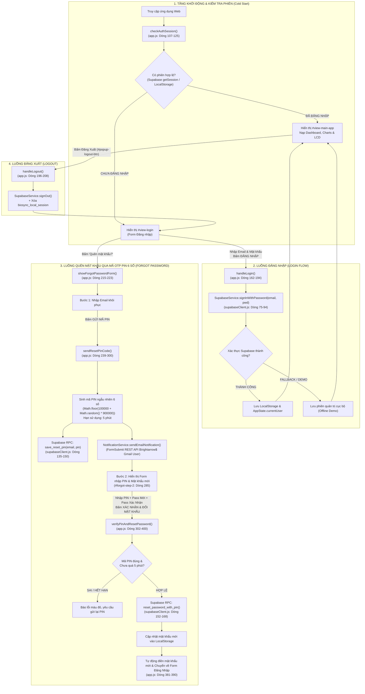

---

### 4.2. Sơ Đồ Tuần Tự Quên Mật Khẩu & Xác Thực Mã OTP PIN (Sequence Diagram)

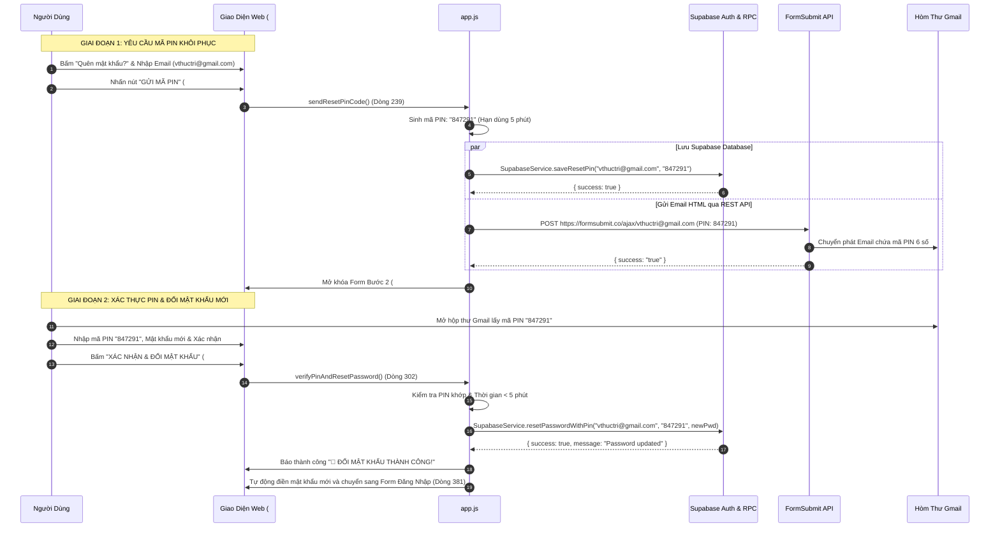

---

### 4.3. Bảng Đối Soát Thành Phần Giao Diện Đăng Nhập & Bảo Mật ([index.html](file:///d:/web_vlcntt/index.html))

| Khối Giao Diện | ID Phần Tử DOM | Vị Trí Dòng Code | Chức Năng Chi Tiết |
| :--- | :--- | :---: | :--- |
| **Màn Hình Đăng Nhập Toàn Trang** | `#view-login` | **Dòng 52** | Vùng phủ toàn màn hình bảo vệ hệ thống khi chưa đăng nhập |
| **Khối Form Đăng Nhập Chính** | `#login-card-section` | **Dòng 55** | Chứa ô nhập Email, Mật khẩu và Nút Đăng nhập |
| **Ô Nhập Email Đăng Nhập** | `#login-username` | **Dòng 79** | Trường điền tài khoản Email |
| **Ô Nhập Password Đăng Nhập** | `#login-password` | **Dòng 89** | Trường điền mật khẩu đăng nhập |
| **Nút Đăng Nhập** | `#login-submit-btn` | **Dòng 98** | Gọi hàm `handleLogin()` |
| **Khối Form Quên Mật Khẩu** | `#forgot-password-section` | **Dòng 104** | Form 2 bước khôi phục mật khẩu qua Email |
| **Ô Nhập Email Quên Pass (Bước 1)**| `#forgot-email-input` | **Dòng 115** | Điền email nhận mã PIN |
| **Nút Gửi Mã PIN** | `#forgot-send-pin-btn`| **Dòng 122** | Gọi hàm `sendResetPinCode()` |
| **Khối Bước 2 (Mã PIN & Mật khẩu mới)**| `#forgot-step-2` | **Dòng 129** | Ẩn mặc định, tự động hiện sau khi gửi PIN thành công |
| **Ô Nhập Mã PIN 6 Số** | `#forgot-pin-input` | **Dòng 137** | Trường nhập mã xác thực OTP 6 ký tự số |
| **Ô Nhập Mật Khẩu Mới** | `#forgot-new-pwd` | **Dòng 145** | Trường nhập mật khẩu mới (tối thiểu 6 ký tự) |
| **Ô Xác Nhận Mật Khẩu Mới** | `#forgot-confirm-pwd` | **Dòng 153** | Trường xác nhận lại mật khẩu mới |
| **Nút Xác Nhận Đổi Mật Khẩu** | `#forgot-verify-btn` | **Dòng 161** | Gọi hàm `verifyPinAndResetPassword()` |

---

### 4.4. Chi Tiết Các Hàm & Dòng Lệnh Cốt Lõi (Nhóm 4)

#### 1. Xử lý Đăng nhập & Duy trì phiên ([js/app.js](file:///d:/web_vlcntt/js/app.js))
* **Kiểm tra phiên đăng nhập tự động (`checkAuthSession()`, Dòng 107 – 125):**
  ```javascript
  // Dòng 107-125 trong js/app.js
  async function checkAuthSession() {
      const savedSession = localStorage.getItem("biosync_local_session");
      if (window.SupabaseService && window.SupabaseService.isConnected()) {
          const session = await window.SupabaseService.getCurrentSession();
          if (session && session.user) {
              setLoggedInUser(session.user);
              return;
          }
      }
      if (savedSession) {
          setLoggedInUser(JSON.parse(savedSession));
      } else {
          AppState.isLoggedIn = false;
          document.getElementById("view-login").classList.remove("hidden");
          document.getElementById("view-main-app").classList.add("hidden");
      }
  }
  ```

* **Thực hiện Đăng nhập (`handleLogin()`, Dòng 162 – 194):**
  ```javascript
  // Dòng 162-185 trong js/app.js
  window.handleLogin = async function () {
      const emailInput = document.getElementById("login-username")?.value.trim();
      const pwdInput = document.getElementById("login-password")?.value;
      
      let authResult = null;
      if (window.SupabaseService && window.SupabaseService.isConnected()) {
          authResult = await window.SupabaseService.signInWithPassword(emailInput, pwdInput);
      }
      if (authResult && authResult.success) {
          localStorage.setItem("biosync_local_session", JSON.stringify(authResult.user));
          setLoggedInUser(authResult.user);
      }
  };
  ```

#### 2. Xử lý Quên mật khẩu & Đổi mật khẩu qua mã OTP PIN ([js/app.js](file:///d:/web_vlcntt/js/app.js))
* **Sinh mã PIN 6 số & Gửi Email (`sendResetPinCode()`, Dòng 239 – 300):**
  ```javascript
  // Dòng 259-278 trong js/app.js
  const pin = Math.floor(100000 + Math.random() * 900000).toString();
  currentResetPin = pin;
  currentResetEmail = emailInput;
  pinExpiryTime = Date.now() + 5 * 60 * 1000; // Hiệu lực 5 phút

  // Lưu mã PIN lên Supabase
  if (window.SupabaseService && window.SupabaseService.isConnected()) {
      await window.SupabaseService.saveResetPin(emailInput, pin);
  }
  // Gửi Email FormSubmit
  await window.NotificationService.sendEmailNotification(
      `🔐 MÃ PIN XÁC THỰC KHÔI PHỤC MẬT KHẨU: [ ${pin} ]`,
      `Mã PIN tạm thời để đặt lại mật khẩu của bạn là: [ ${pin} ]. Hiệu lực 5 phút.`,
      emailInput
  );
  ```

* **Xác thực PIN & Cập nhật mật khẩu mới (`verifyPinAndResetPassword()`, Dòng 302 – 400):**
  ```javascript
  // Dòng 318-375 trong js/app.js
  if (Date.now() > pinExpiryTime) {
      step2Msg.textContent = "❌ Mã PIN đã hết hạn (sau 5 phút).";
      return;
  }
  if (pinInput !== currentResetPin) {
      step2Msg.textContent = "❌ Mã PIN không chính xác!";
      return;
  }
  // Đổi mật khẩu trên database Supabase
  if (window.SupabaseService && window.SupabaseService.isConnected()) {
      await window.SupabaseService.resetPasswordWithPin(currentResetEmail, pinInput, newPwd);
  }
  // Tự động điền mật khẩu mới và chuyển về trang đăng nhập
  ```

---

*Tài liệu tóm lược tập trung 4 nhóm logic phục vụ thuyết trình & bảo vệ đồ án chuyên ngành Công nghệ thông tin.*


