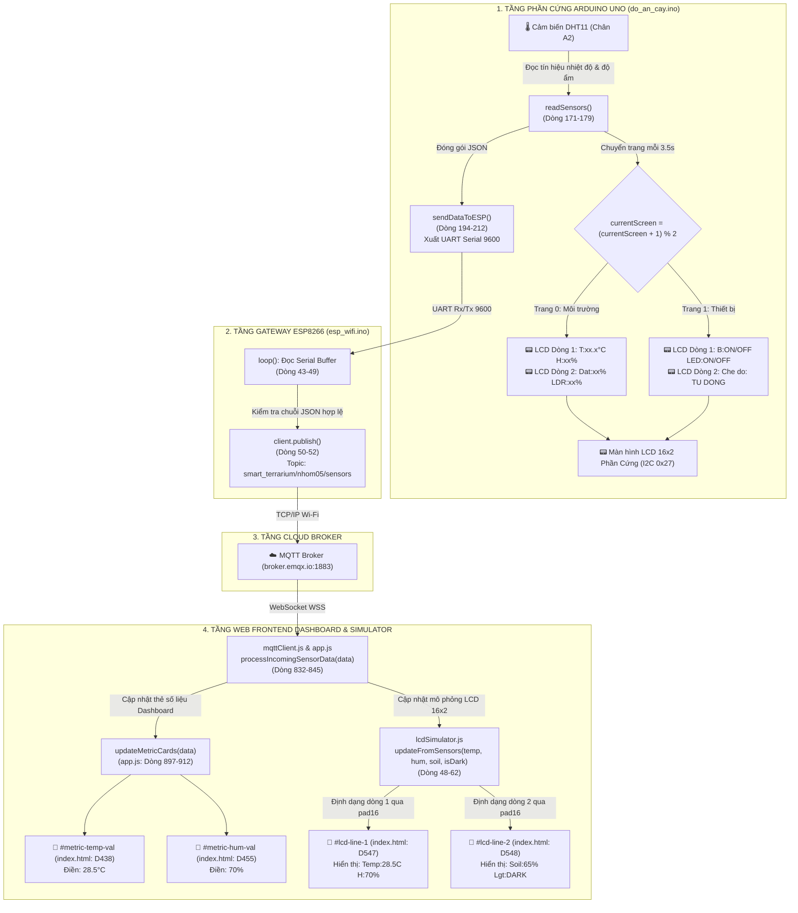
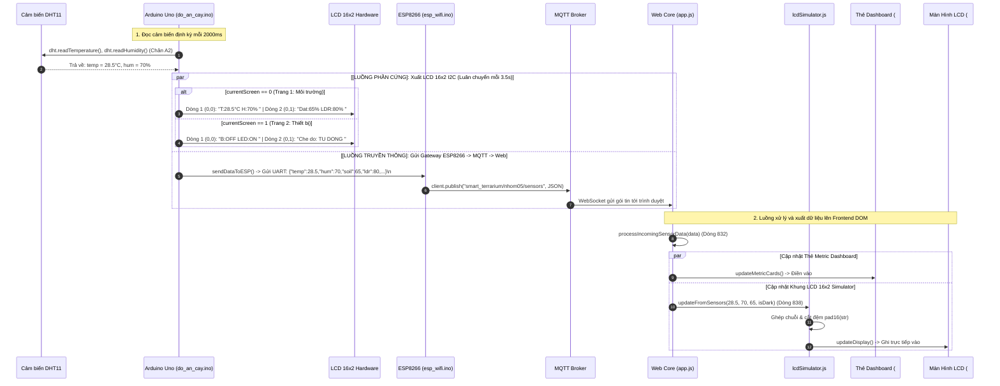
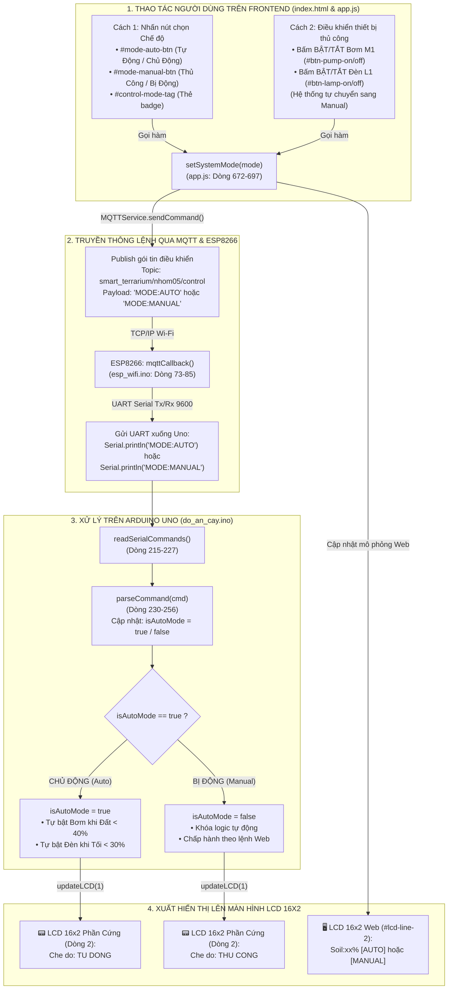
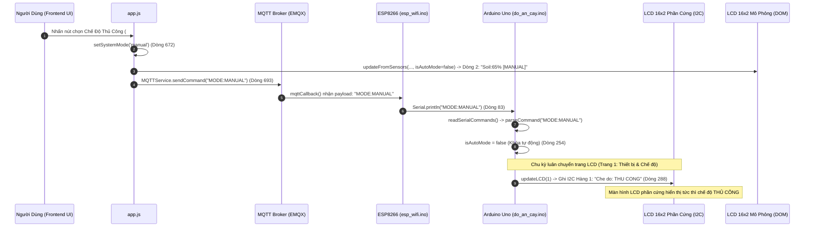
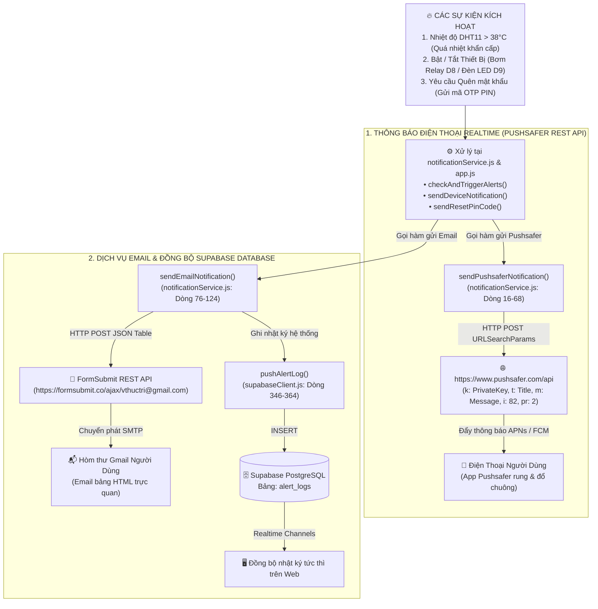
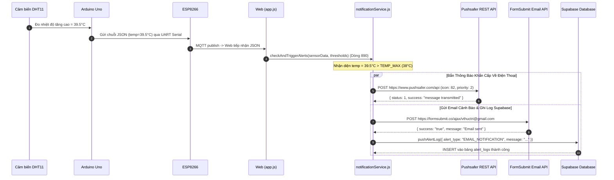
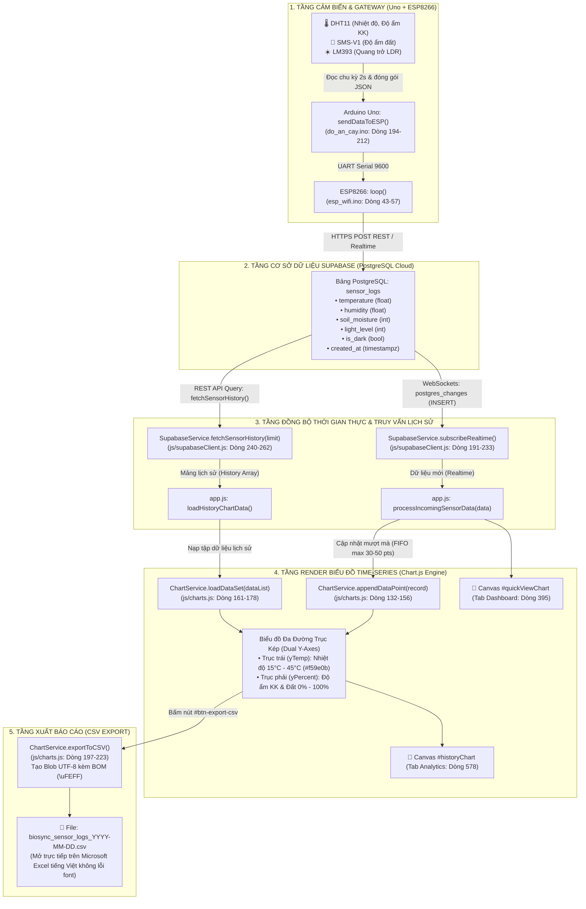
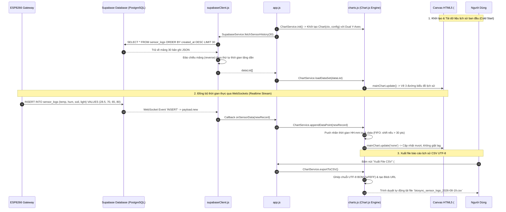

# 🌿 BÁO CÁO FLOW CODE & SƠ ĐỒ HỆ THỐNG TRỌNG TÂM

> **Tài liệu phân tích luồng code (Flow Code), sơ đồ khối, sơ đồ tuần tự và tra cứu dòng lệnh chi tiết cho 3 nhóm chức năng trọng tâm:**
> 1. 🌡️📟 **NHÓM 1: Cảm biến nhiệt độ DHT11 & Màn hình LCD 16x2 I2C** *(Hardware Uno $\rightarrow$ Gateway ESP8266 $\rightarrow$ Web Dashboard & LCD Simulator)*
> 2. 📧📱 **NHÓM 2: Dịch vụ gửi Email (Supabase) & Thông báo nhanh qua điện thoại (Pushsafer)** *(Cảnh báo quá nhiệt DHT11, Thiết bị & Khôi phục tài khoản)*
> 3. 📊📈 **NHÓM 3: Cơ sở dữ liệu (Supabase) & Biểu đồ Time-series đa đường (Chart.js)** *(Lưu trữ PostgreSQL Cloud, Realtime WebSockets, Biểu đồ trục kép & Xuất CSV)*

---

## 📑 BẢNG TRA CỨU NHANH THEO CÁC NHÓM LOGIC (FILE - HÀM - DÒNG CODE)

| Nhóm Chức Năng | Tầng Hệ Thống | Tên File | Tên Hàm / Đoạn Code | Vị Trí Dòng Code | Nhiệm Vụ Chi Tiết |
| :--- | :--- | :--- | :--- | :---: | :--- |
| **1. DHT11 & LCD 16x2** | **Hardware Uno** | `do_an_cay/do_an_cay.ino` | `setup()` | **87 - 102** | Khởi tạo `dht.begin()`, `lcd.init()`, nạp ký tự `°C` và hiển thị Splash Screen |
| | | `do_an_cay/do_an_cay.ino` | `readSensors()` | **171 - 179** | Đọc nhiệt độ (°C) & độ ẩm (%RH) từ chân A2 qua thư viện `DHT.h` |
| | | `do_an_cay/do_an_cay.ino` | `updateLCD()` | **259 - 290** | Luân chuyển 2 trang LCD: Trang 1 (Môi trường `T:..C`), Trang 2 (Chế độ `Che do: TU DONG/THU CONG`) |
| | | `do_an_cay/do_an_cay.ino` | `parseCommand()` | **230 - 256** | Giải mã lệnh `MODE:AUTO` / `MODE:MANUAL` từ Web để đổi biến `isAutoMode` |
| | | `do_an_cay/do_an_cay.ino` | `sendDataToESP()` | **194 - 212** | Đóng gói JSON kèm trường `"auto": 1/0` gửi qua UART Serial |
| | **Gateway ESP8266**| `esp_wifi/esp_wifi.ino` | `loop()`, `mqttCallback()`| **43 - 57, 73 - 85** | Đẩy JSON lên Topic Sensors & Nhận `MODE:AUTO/MANUAL` từ Web bắn xuống Uno qua Serial |
| | **Web Dashboard** | `js/app.js` | `setSystemMode()` | **672 - 697** | Xử lý thao tác bấm nút chế độ của user, đổi UI và gửi lệnh MQTT `MODE:AUTO/MANUAL` |
| | | `js/app.js` | `processIncomingSensorData()` | **832 - 895** | Tiếp nhận gói tin JSON từ MQTT Broker, điều phối cập nhật UI và LCD Simulator |
| | | `js/app.js` | `updateMetricCards()` | **897 - 912** | Cập nhật số liệu nhiệt độ (°C) và độ ẩm (%) lên thẻ đo đạc Dashboard |
| | **Mô phỏng LCD** | `js/lcdSimulator.js` | `updateFromSensors()` | **48 - 68** | Định dạng chuỗi `Temp:xx.xC H:xx%` (Dòng 1) và `Soil:xx% [AUTO/MANUAL]` (Dòng 2) |
| | | `js/lcdSimulator.js` | `updateDeviceStatus()` | **70 - 85** | Mô phỏng Trang 2 LCD hiển thị Bơm, Đèn và `Che do: TU DONG / THU CONG` |
| | | `js/lcdSimulator.js` | `pad16()`, `updateDisplay()` | **15 - 42** | Cắt/đệm chuẩn 16 ký tự và ghi vào DOM HTML `#lcd-line-1`, `#lcd-line-2` |
| **2. Email & Pushsafer**| **Pushsafer (Phone)**| `js/notificationService.js`| `sendPushsaferNotification()`| **16 - 68** | Tạo URLSearchParams và gửi HTTP POST tới `https://www.pushsafer.com/api` |
| | | `js/notificationService.js`| `checkAndTriggerAlerts()` | **158 - 178** | Tự động bắn Pushsafer khẩn cấp (icon 82, priority 2) khi DHT11 quá nhiệt (>38°C) |
| | | `js/notificationService.js`| `sendDeviceNotification()` | **132 - 153** | Bắn Pushsafer về điện thoại thông báo khi Bơm hoặc Đèn Bật/Tắt |
| | | `js/app.js` | `testPushsaferAlert()` | **1113 - 1141** | Xử lý sự kiện nút bấm Test gửi thông báo Pushsafer trên giao diện Cài đặt |
| | **Email & Supabase** | `js/notificationService.js`| `sendEmailNotification()` | **76 - 124** | Gửi Email HTML qua FormSubmit REST API và tự động gọi Supabase ghi log |
| | | `js/supabaseClient.js` | `pushAlertLog()` | **346 - 364** | Thực hiện `INSERT` lịch sử cảnh báo vào bảng `alert_logs` PostgreSQL |
| | | `js/app.js` | `sendResetPinCode()` | **239 - 300** | Tạo PIN 6 số, lưu Supabase (`save_reset_pin`) và gửi Email khôi phục tài khoản |
| | | `js/app.js` | `testEmailAlert()` | **1143 - 1165** | Xử lý sự kiện nút bấm Test gửi Email cảnh báo trên giao diện Web |
| **3. Database & Time-series** | **Supabase DB** | `supabase/schema.sql` | Table `sensor_logs` | **12 - 25** | Khởi tạo bảng PostgreSQL lưu trữ chuỗi thời gian: `temperature`, `humidity`, `soil_moisture` |
| | | `js/supabaseClient.js` | `subscribeRealtime()` | **191 - 233** | Lắng nghe WebSocket sự kiện `INSERT` trên bảng `sensor_logs` |
| | | `js/supabaseClient.js` | `fetchSensorHistory()` | **240 - 262** | Truy vấn mốc lịch sử thời gian (`order created_at desc`) từ Supabase |
| | **Engine Biểu Đồ** | `js/charts.js` | `initChart()` | **13 - 127** | Khởi tạo Chart.js đa đường với 2 trục Y (`yTemp` °C và `yPercent` %) |
| | | `js/charts.js` | `appendDataPoint()` | **132 - 156** | Thêm 1 điểm thời gian thực mượt mà (FIFO max 30-50 điểm) |
| | | `js/charts.js` | `loadDataSet()` | **161 - 178** | Nạp toàn bộ mảng dữ liệu lịch sử từ database vào Chart.js |
| | | `js/charts.js` | `exportToCSV()` | **197 - 223** | Trích xuất toàn bộ dữ liệu time-series ra file `CSV UTF-8 (BOM)` |
| | **Dashboard Web** | `js/app.js` | `initQuickDashboardChart()` | **984 - 1040** | Khởi tạo biểu đồ Quick View Chart thu nhỏ tại trang Tổng quan |
| | | `js/app.js` | `appendQuickChartPoint()` | **1042 - 1070** | Đẩy điểm dữ liệu mới vào biểu đồ Quick View của Dashboard |

---

# 🌡️📟 NHÓM 1: CẢM BIẾN NHIỆT ĐỘ DHT11 & MÀN HÌNH LCD 16x2 I2C

### 1.1. Sơ Đồ Khối Toàn Diện (End-to-End Flowchart)



---

### 1.2. Sơ Đồ Tuần Tự Xuất Thông Tin LCD & Frontend (Sequence Diagram)



---

### 1.3. Bảng Ma Trận 16x2 Ký Tự (LCD Phần Cứng & LCD Mô Phỏng Web)

#### A. Màn hình LCD 16x2 Phần Cứng (Luân chuyển mỗi 3.5 giây qua `updateLCD()`)
```text
Trang 0 (Môi Trường):
[Hàng 0] | T | : | 2 | 8 | . | 5 | ° | C |   | H | : | 7 | 0 | % |   |   | (16 ký tự)
[Hàng 1] | D | a | t | : | 6 | 5 | % |   |   | L | D | R | : | 8 | 0 | % | (16 ký tự)

Trang 1 (Thiết Bị & Chế Độ):
[Hàng 0] | B | : | O | F | F |   |   | L | E | D | : | O | N |   |   |   | (16 ký tự)
[Hàng 1] | C | h | e |   | d | o | : |   | T | U |   | D | O | N | G |   | (16 ký tự)
```

#### B. Màn hình LCD 16x2 Mô Phỏng Web (`lcdSimulator.js` $\rightarrow$ `#tab-analytics`)
```text
Trang Cảm Biến:
[Dòng 1 - #lcd-line-1] | T | e | m | p | : | 2 | 8 | . | 5 | C |   | H | : | 7 | 0 | % | (16 ký tự)
[Dòng 2 - #lcd-line-2] | S | o | i | l | : | 6 | 5 | % |   | [ | A | U | T | O | ] |   | (16 ký tự)

Trang Thiết Bị & Chế Độ (updateDeviceStatus):
[Dòng 1 - #lcd-line-1] | B | : | O | F | F |   |   | L | E | D | : | O | N |   |   |   | (16 ký tự)
[Dòng 2 - #lcd-line-2] | C | h | e |   | d | o | : |   | T | H | U |   | C | O | N | G | (16 ký tự)
```

---

### 1.4. Luồng Xuất Chế Độ Chủ Động / Bị Động Từ Thao Tác Người Dùng Lên LCD 16x2





---

### 1.5. Bảng Đối Soát Hành Động Người Dùng $\rightarrow$ Dữ Liệu LCD 16x2

| Thao Tác Của Người Dùng | Hàm JS Kích Hoạt | Lệnh Gửi MQTT / Serial | Trạng Thái `isAutoMode` | Hiển Thị LCD Phần Cứng (Trang 1 Dòng 1) | Hiển Thị LCD Mô Phỏng Web (Dòng 2) |
| :--- | :--- | :--- | :---: | :--- | :--- |
| **Bấm nút [Tự Động]** | `setSystemMode('auto')` | `"MODE:AUTO"` | `true` (Chủ động) | `Che do: TU DONG ` | `Soil:xx% [AUTO]  ` |
| **Bấm nút [Thủ Công]** | `setSystemMode('manual')`| `"MODE:MANUAL"` | `false` (Bị động) | `Che do: THU CONG` | `Soil:xx% [MANUAL]` |
| **Bấm BẬT Máy Bơm M1** | `turnOnPump()` | `"PUMP:1"` | `false` (Bị động) | `B:ON   Che do: THU CONG` | `Soil:xx% [MANUAL]` |
| **Bấm TẮT Máy Bơm M1** | `turnOffPump()` | `"PUMP:0"` | `false` (Bị động) | `B:OFF  Che do: THU CONG` | `Soil:xx% [MANUAL]` |
| **Bấm BẬT Đèn LED L1** | `turnOnLamp()` | `"LED:1"` | `false` (Bị động) | `LED:ON Che do: THU CONG` | `Soil:xx% [MANUAL]` |
| **Bấm TẮT Đèn LED L1** | `turnOffLamp()` | `"LED:0"` | `false` (Bị động) | `LED:OFF Che do: THU CONG`| `Soil:xx% [MANUAL]` |

---

### 1.6. Vị Trí Cụ Thể Trên Giao Diện Frontend ([index.html](file:///d:/web_vlcntt/index.html))

| Tên Khối Giao Diện | File Nguồn | ID Phần Tử DOM | Vị Trí Dòng Code | Chức Năng Hiển Thị |
| :--- | :--- | :--- | :---: | :--- |
| **Khung Màn hình LCD 16x2** | `index.html` | `#lcd-screen-container` | **Dòng 546** | Hộp chứa nền xanh LCD retro, viền phát sáng, chứa 2 dòng hiển thị |
| **Dòng 1 LCD 16x2** | `index.html` | `#lcd-line-1` | **Dòng 547** | Hiển thị chuỗi Nhiệt độ & Độ ẩm DHT11 (`Temp:xx.xC H:xx%`) |
| **Dòng 2 LCD 16x2** | `index.html` | `#lcd-line-2` | **Dòng 548** | Hiển thị chuỗi Độ ẩm đất & Trạng thái sáng (`Soil:xx% Lgt:DARK/SUNNY`) |
| **Tab Chứa LCD Simulator** | `index.html` | `#tab-analytics` | **Dòng 524** | Tab Phân tích & Dự đoán (Analytics) trên thanh điều hướng |
| **Thẻ Đo Nhiệt Độ Dashboard**| `index.html`| `#metric-temp-val` | **Dòng 438** | Thẻ lớn hiển thị số đo nhiệt độ tức thời (°C) |
| **Thẻ Đo Độ Ẩm Dashboard** | `index.html` | `#metric-hum-val` | **Dòng 455** | Thẻ lớn hiển thị số đo độ ẩm không khí (%) |
| **Thẻ Đo Độ Ẩm Đất** | `index.html` | `#metric-soil-val` | **Dòng 472** | Thẻ lớn hiển thị phần trăm độ ẩm đất (%) |
| **Thẻ Đo Quang Trở LDR** | `index.html` | `#metric-light-val` | **Dòng 489** | Thẻ lớn hiển thị độ sáng Lux & trạng thái Ngày/Đêm |

---

### 1.7. Chi Tiết Các Hàm & Dòng Lệnh Cốt Lõi (Nhóm 1)

#### 1. Mạch Phần Cứng Arduino Uno ([do_an_cay.ino](file:///d:/web_vlcntt/do_an_cay/do_an_cay.ino))
* **Khởi tạo chân & LCD I2C (`setup()`, Dòng 87 – 102):**
  ```cpp
  // Dòng 87-102 trong do_an_cay/do_an_cay.ino
  dht.begin();
  lcd.init();
  lcd.backlight();
  lcd.createChar(0, degreeChar); // Nạp byte ký tự °C vào CGRAM của LCD

  lcd.setCursor(0, 0);
  lcd.print("SMART TERRARIUM ");
  lcd.setCursor(0, 1);
  lcd.print("NHOM 05 - 24C03 ");
  delay(2000);
  lcd.clear();
  ```

* **Đọc cảm biến DHT11 (`readSensors()`, Dòng 171 – 179):**
  ```cpp
  // Dòng 171-179 trong do_an_cay/do_an_cay.ino
  void readSensors() {
    float t = dht.readTemperature();
    float h = dht.readHumidity();
    if (!isnan(t) && !isnan(h)) {
      temperature = t;
      humidity = h;
    }
    ...
  }
  ```

* **Hiển thị luân phiên 2 trang lên LCD 16x2 I2C (`updateLCD()`, Dòng 259 – 290):**
  ```cpp
  // Dòng 259-290 trong do_an_cay/do_an_cay.ino
  void updateLCD(int screen) {
    if (screen == 0) {
      // Trang 1: Thông số nhiệt độ, độ ẩm không khí & đất, ánh sáng
      lcd.setCursor(0, 0);
      lcd.print("T:");
      lcd.print(temperature, 1);
      lcd.write(0); // Ký tự độ °
      lcd.print("C H:");
      lcd.print(humidity, 0);
      lcd.print("%   ");

      lcd.setCursor(0, 1);
      lcd.print("Dat:");
      lcd.print(soilPercent);
      lcd.print("%  LDR:");
      lcd.print(ldrPercent);
      lcd.print("%   ");
    } 
    else if (screen == 1) {
      // Trang 2: Trạng thái Máy Bơm, Đèn LED & Chế độ vận hành
      lcd.setCursor(0, 0);
      lcd.print("B:");
      lcd.print(pumpState ? "ON " : "OFF");
      lcd.print(" LED:");
      lcd.print(ledState ? "ON " : "OFF");
      lcd.print("    ");

      lcd.setCursor(0, 1);
      lcd.print("Che do: ");
      lcd.print(isAutoMode ? "TU DONG " : "THU CONG");
    }
  }
  ```

#### 2. Mạch Gateway ESP8266 ([esp_wifi.ino](file:///d:/web_vlcntt/esp_wifi/esp_wifi.ino))
* **Đọc Serial và đẩy lên MQTT Broker (`loop()`, Dòng 43 – 57):**
  ```cpp
  // Dòng 43-57 trong esp_wifi/esp_wifi.ino
  while (Serial.available() > 0) {
    char c = Serial.read();
    if (c == '\n' || c == '\r') {
      if (serialData.length() > 0) {
        serialData.trim();
        if (serialData.startsWith("{") && serialData.endsWith("}")) {
          client.publish(topic_sensors, serialData.c_str());
        }
        serialData = "";
      }
    } else {
      serialData += c;
    }
  }
  ```

#### 3. Mô phỏng LCD 16x2 trên Web ([js/lcdSimulator.js](file:///d:/web_vlcntt/js/lcdSimulator.js))
* **Khởi tạo DOM elements (`initLCD()`, Dòng 24 – 31):**
  ```javascript
  // Dòng 24-31 trong js/lcdSimulator.js
  function initLCD() {
      line1Element = document.getElementById("lcd-line-1");
      line2Element = document.getElementById("lcd-line-2");
      backlightElement = document.getElementById("lcd-screen-container");

      updateDisplay("LCD 16x2 I2C READY", "DHT11 CONNECTED");
  }
  ```

* **Định dạng số liệu dòng 1 & 2 (`updateFromSensors()`, Dòng 48 – 62):**
  ```javascript
  // Dòng 48-62 trong js/lcdSimulator.js
  function updateFromSensors(temp, hum, soil, lightIsDark) {
      const tStr = temp !== undefined ? temp.toFixed(1) : "--.-";
      const hStr = hum !== undefined ? hum.toFixed(0) : "--";
      const l1 = `Temp:${tStr}C H:${hStr}%`;

      const sStr = soil !== undefined ? soil.toFixed(0) : "--";
      const lightStr = lightIsDark ? "DARK" : "SUNNY";
      const l2 = `Soil:${sStr}% Lgt:${lightStr}`;

      updateDisplay(l1, l2);
  }
  ```

* **Cắt đệm chuẩn 16 ký tự & Cập nhật DOM HTML (`pad16()` & `updateDisplay()`, Dòng 15 – 42):**
  ```javascript
  // Dòng 15-19 & 35-42 trong js/lcdSimulator.js
  function pad16(str) {
      if (!str) str = "";
      if (str.length > 16) return str.substring(0, 16);
      return str.padEnd(16, " ");
  }

  function updateDisplay(line1Text, line2Text) {
      if (line1Element) line1Element.textContent = pad16(line1Text);
      if (line2Element) line2Element.textContent = pad16(line2Text);
  }
  ```

---

# 📧📱 NHÓM 2: DỊCH VỤ EMAIL (SUPABASE) & THÔNG BÁO NHANH QUA ĐIỆN THOẠI (PUSHSAFER)

### 2.1. Sơ Đồ Khối Toàn Diện (End-to-End Flowchart)



---

### 2.2. Sơ Đồ Tuần Tự Cảnh Báo Quá Nhiệt (Sequence Diagram)



---

### 2.3. Chi Tiết Các Hàm & Dòng Lệnh Cốt Lõi (Nhóm 2)

#### 1. Thông Báo Nhanh Qua Điện Thoại (Pushsafer API)
* **Gửi HTTP POST Pushsafer (`sendPushsaferNotification()`, Dòng 16 – 68 trong `js/notificationService.js`):**
  ```javascript
  // Dòng 36-52 trong js/notificationService.js
  const params = new URLSearchParams({
      k: privateKey.trim(),
      t: title || "Smart Terrarium Alert",
      m: message || "Thông báo từ hệ thống Terrarium",
      s: options.sound !== undefined ? options.sound : "1",      // Chuông
      v: options.vibrate !== undefined ? options.vibrate : "3",  // Rung mạnh
      i: options.icon !== undefined ? options.icon : "82",       // Icon cảm biến
      pr: options.priority !== undefined ? options.priority : "2" // Độ ưu tiên cao nhất
  });

  const response = await fetch("https://www.pushsafer.com/api", {
      method: "POST",
      headers: { "Content-Type": "application/x-www-form-urlencoded" },
      body: params.toString()
  });
  ```

* **Tự động kích hoạt khi DHT11 quá nhiệt (`checkAndTriggerAlerts()`, Dòng 158 – 178 trong `js/notificationService.js`):**
  ```javascript
  // Dòng 163-169 trong js/notificationService.js
  if (temp > thresholds.TEMP_MAX) {
      const title = "🔥 CẢNH BÁO: QUÁ NHIỆT TERRARIUM!";
      const msg = `Nhiệt độ hiện tại đạt ${temp.toFixed(1)}°C (vượt ngưỡng cho phép ${thresholds.TEMP_MAX}°C)...`;
      
      await sendPushsaferNotification(title, msg, { icon: 82, priority: 2 });
      await sendEmailNotification(title, msg);
  }
  ```

* **Thông báo Bật/Tắt thiết bị Bơm & Đèn (`sendDeviceNotification()`, Dòng 132 – 153 trong `js/notificationService.js`):**
  Bắn Pushsafer thông báo khi máy bơm hoặc đèn bật/tắt (manual hoặc auto).

---

#### 2. Dịch Vụ Gửi Email & Đồng Bộ Supabase Database
* **Gửi Email bảng HTML (`sendEmailNotification()`, Dòng 76 – 124 trong `js/notificationService.js`):**
  ```javascript
  // Dòng 90-104 trong js/notificationService.js
  const response = await fetch(`https://formsubmit.co/ajax/${encodeURIComponent(targetEmail)}`, {
      method: "POST",
      headers: { "Content-Type": "application/json", "Accept": "application/json" },
      body: JSON.stringify({
          _subject: `🌱 [Smart Terrarium Nhóm 05] ${subject || 'CẢNH BÁO HỆ THỐNG'}`,
          "Tiêu Đề Cảnh Báo": subject,
          "Nội Dung Chi Tiết": body,
          "Hệ Thống Giám Sát": "BioSync Smart Terrarium - Lớp 24C03 (Nhóm 05)",
          "Thời Gian Ghi Nhận": new Date().toLocaleString("vi-VN"),
          _template: "table"
      })
  });
  ```

* **Ghi nhật ký vào bảng `alert_logs` Supabase (`pushAlertLog()`, Dòng 346 – 364 trong `js/supabaseClient.js`):**
  ```javascript
  // Dòng 351-358 trong js/supabaseClient.js
  const { error } = await supabaseClient
      .from('alert_logs')
      .insert([{
          alert_type: alertObj.alert_type || "EMAIL_NOTIFICATION",
          severity: alertObj.severity || "WARNING",
          message: alertObj.message || ""
      }]);
  ```

* **Email Mã PIN Khôi Phục Tài Khoản (`sendResetPinCode()`, Dòng 239 – 300 trong `js/app.js`):**
  Sinh mã PIN 6 số ngẫu nhiên, lưu vào Supabase và gửi qua Email FormSubmit để xác thực quên mật khẩu.

---

# 📊📈 NHÓM 3: CƠ SỞ DỮ LIỆU (SUPABASE) & BIỂU ĐỒ TIME-SERIES (CHART.JS)

### 3.1. Sơ Đồ Khối Toàn Diện (End-to-End Flowchart)



---

### 3.2. Sơ Đồ Tuần Tự Đồng Bộ Dữ Liệu & Render Time-series (Sequence Diagram)



---

### 3.3. Cấu Trúc Bảng Dữ Liệu `sensor_logs` (Supabase PostgreSQL)

| Tên Cột (Column) | Kiểu Dữ Liệu | Ràng Buộc | Ý Nghĩa / Nguồn Cung Cấp |
| :--- | :--- | :--- | :--- |
| `id` | `BIGSERIAL` | `PRIMARY KEY` | Khóa chính tự tăng của mỗi bản ghi đo |
| `created_at` | `TIMESTAMPTZ` | `DEFAULT now()` | Mốc thời gian ISO 8601 (Dùng cho trục hoành Time-series) |
| `temperature` | `NUMERIC(4,1)`| `NOT NULL` | Nhiệt độ môi trường (°C) từ cảm biến DHT11 |
| `humidity` | `NUMERIC(4,1)`| `NOT NULL` | Độ ẩm không khí (%RH) từ cảm biến DHT11 |
| `soil_moisture`| `INTEGER` | `DEFAULT 0` | Độ ẩm đất (%) từ cảm biến điện dung SMS-V1 |
| `light_level` | `INTEGER` | `DEFAULT 0` | Cường độ sáng (%) từ quang trở LDR / LM393 |
| `is_dark` | `BOOLEAN` | `DEFAULT false` | Cờ trạng thái môi trường tối/sáng |

---

### 3.4. Kiến Trúc Hệ Trục Kép Dual Y-Axes & Chiến Lược Cập Nhật Biểu Đồ

1. **Hệ 2 trục tung độc lập (Dual Y-Axes):**
   * **Trục trái (`yTemp`):** Chuyên dụng cho **Nhiệt độ (°C)**, dải đo đề xuất `15°C - 45°C`, nét vẽ màu vàng/hổ phách (`#f59e0b`), vùng phủ gradient `rgba(245, 158, 11, 0.12)`.
   * **Trục phải (`yPercent`):** Chuyên dụng cho **Độ ẩm không khí (%)** (nét vẽ màu Cyan `#06b6d4`) và **Độ ẩm đất (%)** (nét đứt Emerald `#10b981`), dải đo cố định `0% - 100%`.
2. **Cơ chế cập nhật không giật lag (`mainChart.update('none')`):**
   * Tắt animation chuyển cảnh nặng khi nhận điểm realtime mỗi 2 giây, giúp giao diện 60 FPS mượt mà.
   * Áp dụng hàng đợi **FIFO (First In First Out)** giới hạn 30 điểm hiển thị trên màn hình nhằm tránh tràn bộ nhớ RAM trình duyệt.

---

### 3.5. Vị Trí Cụ Thể Trên Giao Diện Frontend ([index.html](file:///d:/web_vlcntt/index.html))

| Tên Phần Tử Giao Diện | File Nguồn | ID Phần Tử DOM | Vị Trí Dòng Code | Chức Năng Chi Tiết |
| :--- | :--- | :--- | :---: | :--- |
| **Canvas Biểu Đồ Time-series Lớn** | `index.html` | `#historyChart` | **Dòng 578** | Vùng vẽ Canvas đồ thị đa đường Chart.js toàn diện |
| **Canvas Biểu Đồ Dashboard Thu Nhỏ**| `index.html` | `#quickViewChart`| **Dòng 395** | Vùng vẽ Canvas biểu đồ nhanh tại trang Tổng quan |
| **Nút Xuất Dữ Liệu CSV** | `index.html` | `#btn-export-csv` | **Dòng 569** | Nút bấm trích xuất toàn bộ dữ liệu time-series ra file CSV |
| **Tab Chứa Biểu Đồ Phân Tích** | `index.html` | `#tab-analytics` | **Dòng 524** | Tab Phân tích dữ liệu & Đồ thị trên thanh điều hướng |
| **Nút Chọn Khung Thời Gian 1H** | `index.html` | `#btn-filter-1h` | **Dòng 562** | Bộ lọc hiển thị dữ liệu lịch sử trong 1 giờ gần nhất |
| **Nút Chọn Khung Thời Gian 24H**| `index.html` | `#btn-filter-24h`| **Dòng 564** | Bộ lọc hiển thị dữ liệu lịch sử trong 24 giờ gần nhất |

---

### 3.6. Chi Tiết Các Hàm & Dòng Lệnh Cốt Lõi (Nhóm 3)

#### 1. Tầng Cơ Sở Dữ Liệu Supabase ([js/supabaseClient.js](file:///d:/web_vlcntt/js/supabaseClient.js))
* **Hàm Ghi Dữ Liệu Cảm Biến Vào Database (`pushSensorData()`, Dòng 327 – 344):**
  ```javascript
  // Dòng 327-344 trong js/supabaseClient.js
  async function pushSensorData(record) {
      if (!supabaseClient) initSupabase();
      if (!supabaseClient) return false;

      try {
          // Thực hiện lệnh INSERT vào bảng PostgreSQL 'sensor_logs'
          const { error } = await supabaseClient
              .from('sensor_logs')
              .insert([record]);

          if (error) {
              console.warn("Lỗi pushSensorData:", error.message);
              return false;
          }
          return true;
      } catch (err) {
          return false;
      }
  }
  ```

* **Hàm Ghi Nhật Ký Cảnh Báo Vào Database (`pushAlertLog()`, Dòng 346 – 364):**
  ```javascript
  // Dòng 346-364 trong js/supabaseClient.js
  async function pushAlertLog(alertObj) {
      if (!supabaseClient) initSupabase();
      if (!supabaseClient) return false;

      try {
          const { error } = await supabaseClient
              .from('alert_logs')
              .insert([{
                  alert_type: alertObj.alert_type || alertObj.type || "SYSTEM_WARN",
                  severity: alertObj.severity || "INFO",
                  message: alertObj.message || ""
              }]);

          if (error) return false;
          return true;
      } catch (err) {
          return false;
      }
  }
  ```

* **Hàm Cập Nhật / Upsert Trạng Thái Điều Khiển Thiết Bị (`updateDeviceControls()`, Dòng 301 – 325):**
  ```javascript
  // Dòng 301-325 trong js/supabaseClient.js
  async function updateDeviceControls(controlsPayload) {
      if (!supabaseClient) initSupabase();
      if (!supabaseClient) return false;

      try {
          const updateRecord = {
              id: 1,
              ...controlsPayload,
              updated_at: new Date().toISOString()
          };
          const { error } = await supabaseClient
              .from('device_controls')
              .upsert(updateRecord);

          return !error;
      } catch (err) {
          return false;
      }
  }
  ```

* **Lắng nghe WebSockets Realtime (`subscribeRealtime()`, Dòng 191 – 233):**
  ```javascript
  // Dòng 201-209 trong js/supabaseClient.js
  realtimeChannel = supabaseClient
      .channel('public:smart_terrarium_realtime')
      // Lắng nghe bản ghi cảm biến mới chèn từ ESP8266
      .on('postgres_changes', { event: 'INSERT', schema: 'public', table: 'sensor_logs' }, payload => {
          console.log("⚡ [Realtime Supabase] Dữ liệu cảm biến mới từ ESP8266:", payload.new);
          if (callbacks.onSensorData) {
              callbacks.onSensorData(payload.new);
          }
      })
      .subscribe();
  ```

* **Truy vấn lịch sử chuỗi thời gian (`fetchSensorHistory()`, Dòng 240 – 262):**
  ```javascript
  // Dòng 245-257 trong js/supabaseClient.js
  const { data, error } = await supabaseClient
      .from('sensor_logs')
      .select('*')
      .order('created_at', { ascending: false })
      .limit(limit);

  if (error) return null;
  // Đảo lại thứ tự thời gian tăng dần để vẽ biểu đồ từ trái sang phải
  return (data || []).reverse();
  ```

#### 2. Tầng Engine Biểu Đồ Chart.js ([js/charts.js](file:///d:/web_vlcntt/js/charts.js))
* **Khởi tạo đồ thị đa đường với hệ 2 trục Y (`initChart()`, Dòng 13 – 127):**
  ```javascript
  // Dòng 22-64 & 99-119 trong js/charts.js
  mainChart = new Chart(ctx, {
      type: 'line',
      data: {
          labels: [],
          datasets: [
              { label: 'Nhiệt độ (°C)', data: [], borderColor: '#f59e0b', yAxisID: 'yTemp' },
              { label: 'Độ ẩm không khí (%)', data: [], borderColor: '#06b6d4', yAxisID: 'yPercent' },
              { label: 'Độ ẩm đất (%)', data: [], borderColor: '#10b981', borderDash: [4, 4], yAxisID: 'yPercent' }
          ]
      },
      options: {
          responsive: true,
          maintainAspectRatio: false,
          scales: {
              yTemp: { type: 'linear', position: 'left', suggestedMin: 15, suggestedMax: 45 },
              yPercent: { type: 'linear', position: 'right', min: 0, max: 100 }
          }
      }
  });
  ```

* **Thêm điểm thời gian thực mượt mà (`appendDataPoint()`, Dòng 132 – 156):**
  ```javascript
  // Dòng 132-156 trong js/charts.js
  function appendDataPoint(record) {
      if (!mainChart) return;
      const timeLabel = new Date(record.created_at || Date.now()).toLocaleTimeString([], { hour: '2-digit', minute: '2-digit', second: '2-digit' });

      mainChart.data.labels.push(timeLabel);
      mainChart.data.datasets[0].data.push(record.temperature);
      mainChart.data.datasets[1].data.push(record.humidity);
      mainChart.data.datasets[2].data.push(record.soil_moisture);

      // FIFO: Giới hạn 30 điểm gần nhất
      if (mainChart.data.labels.length > 30) {
          mainChart.data.labels.shift();
          mainChart.data.datasets.forEach(ds => ds.data.shift());
      }
      mainChart.update('none'); // Cập nhật không giật lag
  }
  ```

* **Xuất tập dữ liệu ra file CSV chuẩn UTF-8 BOM (`exportToCSV()`, Dòng 197 – 223):**
  ```javascript
  // Dòng 203-219 trong js/charts.js
  // Sử dụng ký tự \uFEFF (UTF-8 Byte Order Mark) để Excel mở tiếng Việt chuẩn 100%
  let csvContent = "\uFEFFThoiGian,NhietDo_C,DoAmKhongKhi_%,DoAmDat_%,AnhSang_Lux,TroiToi\n";
  chartHistoryData.forEach(r => {
      const time = new Date(r.created_at || Date.now()).toLocaleString('vi-VN');
      csvContent += `"${time}",${r.temperature},${r.humidity},${r.soil_moisture},${r.light_level || 0},${r.is_dark ? 'CO' : 'KHONG'}\n`;
  });

  const blob = new Blob([csvContent], { type: 'text/csv;charset=utf-8;' });
  const url = URL.createObjectURL(blob);
  const link = document.createElement("a");
  link.setAttribute("href", url);
  link.setAttribute("download", `biosync_sensor_logs_${new Date().toISOString().slice(0, 10)}.csv`);
  document.body.appendChild(link);
  link.click();
  ```

---

*Tài liệu tóm lược tập trung 3 nhóm logic phục vụ thuyết trình & bảo vệ đồ án chuyên ngành Công nghệ thông tin.*

